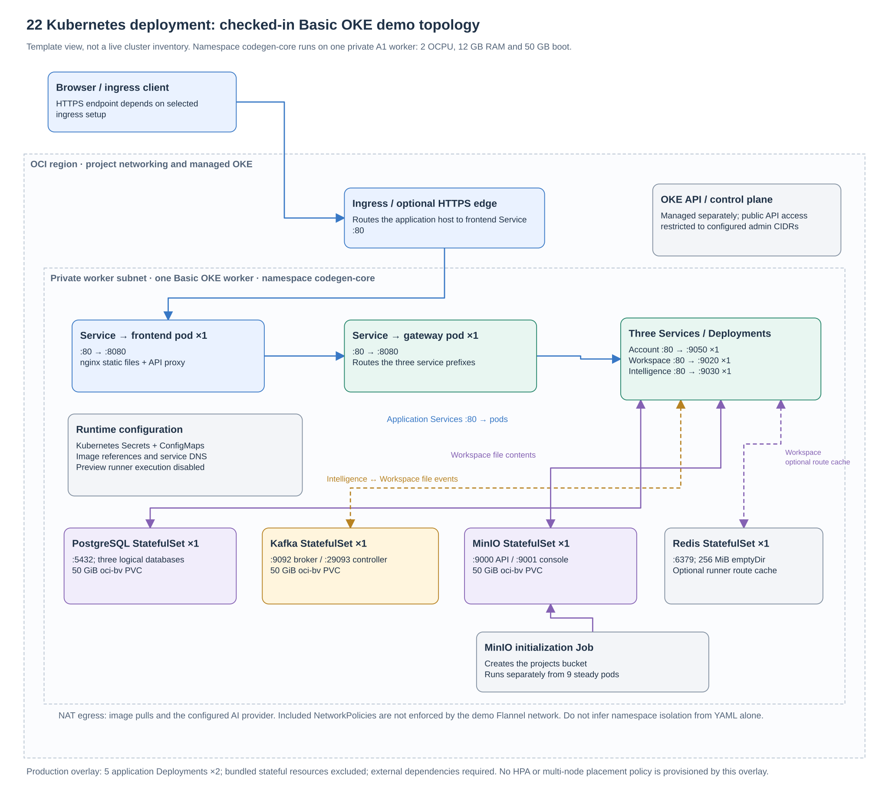
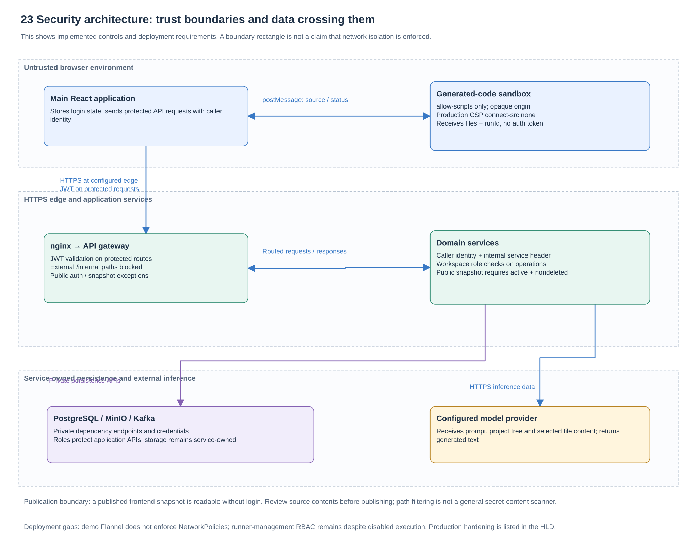

# CodeGen: High Level Design

CodeGen turns a user's request into an editable React application. Its architecture separates account management, project ownership and file storage, and AI generation. An API gateway joins these services behind the browser application. HTTP carries interactive requests; Kafka carries generated-file storage requests and acknowledgements.

**Design baseline:** application source commit [`a5f2276`](https://github.com/Richa-2319/CodeGen-Ai-powered-project-builder/tree/a5f22762396594eb68ff7693cdecda1ea9e9c243). This document describes checked-in behavior and deployment templates. Historical test evidence is identified separately. It does not assert that a cloud installation is currently healthy or publicly reachable. Recommendations are proposed engineering work, not existing capabilities.

Read alongside the [complete diagram index](README.md), [UML views](uml-and-engineering-views.md), [microservice dataflow](microservice-dataflow.md), and [Kubernetes component inventory](kubernetes-components.md).

## 1. Purpose, scope and requirements

The intended journey is: sign up → create a private project → request AI changes → inspect and save files → preview the frontend → share project access or publish a saved snapshot. Account holders can also inspect their plan and recorded daily AI usage. Paid upgrades remain disabled by product choice.

| Requirement | Current design and boundary |
| --- | --- |
| Protect private projects | JWT authentication plus project membership and role checks in the owning service. |
| Generate and retain application files | Stream AI output to the editor; separately persist generated files through Kafka, workspace and object storage. |
| Support editing and preview | Save files through workspace HTTP APIs; execute supported frontend source in an isolated browser frame. |
| Share collaboration access | Owner grants editor/viewer access to existing accounts; no invitation email is sent. |
| Publish a stable public link | Owner publishes a saved-file snapshot; republish updates the same link, unpublish revokes future retrieval. |
| Display plan and consumption | Account owns plan limits; intelligence records daily usage. This is not a cloud billing ledger. |
| Support repeatable deployment | Compose, Kubernetes overlays, OKE Terraform and image publication workflow are provided; installation-specific settings remain external. |

Server-side execution of arbitrary generated projects, arbitrary package installation, persistent preview storage, payment activation and automatic cloud deployment are outside the enabled baseline. The repository defines no availability SLO, latency objective, recovery point, recovery time or tested concurrency target. Those requirements must be agreed before production sizing. [Feature behavior][features]

## 2. System and component architecture

| Component | Responsibility | Owned durable data |
| --- | --- | --- |
| React frontend and NGINX | Authentication screens, project dashboard, editor, streamed generation, sharing, preview and publication UI; same-origin API proxy | None; browser holds the user's session and temporary drafts |
| API gateway | Route `/account`, `/workspace`, `/intelligence`; validate JWTs; reject external internal-route access | None |
| Account service | Identity, password verification, subscriptions, plan limits and user lookup | `account_db`: users, plans, subscriptions |
| Workspace service | Projects, membership, permissions, file metadata and bytes, snapshots and publication | `workspace_db`; project objects in MinIO/S3 |
| Intelligence service | AI orchestration, file-context lookup, SSE response, chat records, delivery status and daily usage | `intelligence_db` |
| Kafka | Decouple generated-file production from workspace storage; return storage results | Broker log |
| Redis | Route cache for the separate, disabled server-preview implementation | No primary business records |

The seven Maven modules include these four runtime Java applications, `common-lib`, Config Server and Eureka. The shared library contains DTOs, events and servlet security configuration; it is linked into applications. Config Server and Eureka remain in source but are excluded from the enabled Compose and Kubernetes service sets. Explicit service URLs and platform DNS provide discovery. These roles should not be drawn as additional running microservices. [Root build][pom] · [Active Kubernetes services][services]

## 3. Interactive requests and service contracts

The browser sends same-origin API calls to frontend NGINX, which forwards all three API prefixes to the gateway. Prefixes remain present because each application uses its corresponding servlet context path. NGINX disables response buffering and permits long responses for SSE. A separate API hostname is also supported by the generic Ingress template. [Frontend proxy][nginx] · [Gateway routes][gateway-config]

| Caller → receiver | Information exchanged | Why the dependency exists |
| --- | --- | --- |
| Workspace → account | Current plan; user details by ID or email | Enforce project allowance and resolve real sharing members |
| Intelligence → account | Current plan | Check the AI allowance before generation |
| Intelligence → workspace | Project permission; file tree; requested file contents | Authorize access and provide source context to the model |
| Workspace → object store | File content writes and reads | Store generated/manual source outside relational metadata |
| Intelligence → configured AI provider | Prompt, system/context material and tool results; streamed model output | Generate source and responses |

Feign's shared interceptor supplies the internal service key and propagates the requesting user's JWT. The asynchronous file-tree and `read_files` paths explicitly carry authorization where thread-local security context cannot be assumed. These are direct service calls, not browser calls bounced through the gateway. Service contracts therefore depend on consistent DTOs, service paths, shared authentication configuration and reachable DNS endpoints. [Shared authentication propagation][shared-auth] · [Workspace account client][workspace-account] · [Intelligence workspace client][intelligence-workspace]

Manual save is synchronous: workspace validates the request and writes object content plus file metadata. AI output takes the asynchronous path below. Preview can combine saved source with recent editor updates, so a visible preview alone is not evidence that all generated files were durably stored.

## 4. Generated-file delivery and consistency

1. Intelligence checks access and allowance, obtains project context, then streams model chunks to the browser.
2. After generation, background processing records usage and chat information, parses file edits, assigns saga IDs and persists delivery tracking.
3. Intelligence publishes each file edit to `file-storage-request-event`, keyed by project. The payload contains project ID, saga ID, path, content and user ID.
4. Workspace checks `processed_events` for the saga. For a new event it saves file bytes and metadata, then records the processed marker.
5. Workspace publishes success/failure to `file-store-responses`, waiting up to ten seconds for broker acknowledgement. A duplicate processed saga resends success without repeating the file write.
6. Intelligence consumes the response and changes the corresponding tracked edit to confirmed or failed.

Tracking is committed before publication, preventing a fast acknowledgement from racing a missing tracking record. It does **not** make the database commit and Kafka send atomic. A process can stop between them. Object writes, workspace metadata and processed markers also span separate operations. Duplicate detection reduces repeated work but does not establish end-to-end exactly-once delivery. Broker retries and application failure states are distinct from a durable, automated reconciliation process. [Request publisher][publisher] · [Workspace consumer][consumer] · [Response handler][response-handler]

**Design implication:** completion of the SSE response means streaming has ended, not that every storage acknowledgement succeeded. Before promising reliable job completion, add an outbox/reconciliation strategy and expose durable per-generation status to the UI. Backward-compatible event schemas and ordered updates to the same project are additional release concerns.

## 5. Data ownership and persistence

Each business service owns its database and Flyway migrations. Separate logical databases and database users are created by the demonstration PostgreSQL initializer. Sharing one PostgreSQL process reduces deployment size but does not remove service ownership boundaries. References such as user IDs in workspace and project IDs in intelligence are cross-service logical references, not cross-database foreign keys. [Database initialization][db-init]

Workspace holds project/member/file metadata, processed saga IDs and publication snapshots. Generated source bytes normally live in the `projects` object-storage bucket. Publications deliberately duplicate a selected set of saved frontend files into a JSON snapshot in the workspace database. Chat sessions, messages, file-edit events and daily usage belong to intelligence. Account data never needs to be directly queried from another service's database.

Snapshot construction is bounded to 200 frontend files, 1 MiB per file and 5 MiB total. Path/type filtering excludes unsupported configuration from the browser bundle; it is not a guarantee that source content contains no secrets. Publishing keeps a stable UUID slug; later private edits remain unpublished until a new snapshot is saved. Unpublish and project deletion prevent future anonymous retrieval. Copies already downloaded cannot be recalled. Project deletion is a soft delete, not a complete object-storage retention policy. [Snapshot builder][snapshot] · [Publication service][publication]

Backups must cover relational data and source objects as a coordinated recovery set. Kafka durability and replays cannot replace those backups. Retention periods, archival, account erasure, object garbage collection and restore procedures remain engineering decisions.

## 6. Kubernetes and infrastructure deployment

The [Kubernetes component inventory](kubernetes-components.md) lists every workload and supporting object, plus the control-plane/node components behind them.

| Workload in `codegen-core` | Demo replicas | Kubernetes Service → container port | Demo storage |
| --- | ---: | --- | --- |
| `codegen-frontend` | 1 | 80 → 8080 | None |
| `api-gateway` | 1 | 80 → 8080 | None |
| `account-service` | 1 | 80 → 9050 | Uses PostgreSQL |
| `workspace-service` | 1 | 80 → 9020 | Uses PostgreSQL and MinIO |
| `intelligence-service` | 1 | 80 → 9030 | Uses PostgreSQL |
| `pgvector` (PostgreSQL 16) | 1 | 5432 | 50 GiB PVC |
| `kafka` | 1 | 9092 client; 29093 controller | 50 GiB PVC |
| `minio` | 1 | 9000 S3; 9001 console | 50 GiB PVC |
| `redis` | 1 | 6379 | 256 MiB `emptyDir`; persistence disabled |

The demo has **nine steady pods**, plus the temporary `minio-init` Job. Three `oci-bv` claims allocate 150 GiB. Redis is only a cache for disabled server-preview routes and is intentionally ephemeral here. The PostgreSQL Service retains the `pgvector` name, but current migrations do not require vectors. Kafka publishes its headless DNS address before readiness to bootstrap the broker. Application/dependency requests total 1.05 CPU and 2112 MiB; limits total 3 CPU and 4224 MiB. System workloads and rollout overlap are additional capacity. [Demo overlay and capacity][demo] · [Demo patches][demo-overlay]

The OKE Terraform template defines a Basic cluster with Flannel overlay networking, one private A1 worker with 2 OCPU/12 GB memory and a 50 GB boot volume. The worker subnet reaches registries and external APIs through NAT. The public Kubernetes control-plane endpoint restricts administrator access to supplied narrow CIDRs. Separate API, private-worker and ingress subnets are defined; an unused historical public-worker subnet is retained. [Cluster definition][cluster] · [Network definition][network]

The generic application Ingress requires an existing compatible controller, DNS and certificate issuer. Its frontend hosts route to the frontend Service; the API host routes to the gateway. Alternatively, an installation can use separately managed OCI HTTPS gateway/load-balancer resources and a private worker backend. The Terraform contains optional supporting rules but does **not** provision that API Gateway or load balancer. A subnet or Ingress manifest alone therefore does not produce a public website. [Ingress][ingress] · [OKE deployment guide][oke]

The production overlay runs **two replicas of each application**, ten application pods total, and excludes all four bundled StatefulSets. Managed or operator-backed PostgreSQL, Kafka, Redis and compatible object storage must be supplied separately with credentials, transport security and backups. PDBs retain one application replica during voluntary disruption; the demo sets `minAvailable: 0`. Multiple replicas do not guarantee availability without adequate workers, failure-domain placement and resilient dependencies. No HPA, autoscaler or topology-spread policy is supplied in this baseline. [Production overlay][production] · [PDBs][pdb]

Compose is a separate single-host option with the same nine steady components, a MinIO initialization container and named volumes, including persistent Redis. Only frontend port 8088 is bound to loopback by default. The optional Caddy overlay exposes 80/443 for a confirmed public hostname. It does not provide node redundancy. [Compose][compose] · [Local and HTTPS deployment][deployment]

## 7. Security and trust boundaries

The diagram separates browser, generated-code, service, persistence and provider boundaries.

- The gateway validates protected requests and blocks `/internal` routes externally. Backend servlet filters validate JWTs; internal endpoints additionally require the shared service key. Workspace remains the authority for project permission checks. The current `EDITOR` role includes project deletion; only the owner manages membership and publication. [Gateway filter][gateway-filter] · [Internal filter][internal-filter] · [Roles][roles]
- The browser stores its JWT in local storage. Generated apps receive file data through `postMessage`, never the account token. Their iframe has `allow-scripts` without same-origin privileges; its CSP blocks network connections, forms and nested frames. This isolates the supported preview runtime, not arbitrary server workloads. [Browser API][browser-api] · [Sandbox wrapper][sandbox] · [Preview CSP][nginx]
- Deployment secrets are external inputs. Kubernetes Secret references keep values out of checked-in manifests; they do not by themselves prove encryption, rotation or least-privilege access. The source uses shared service credentials, not workload-specific identities or mutual TLS.
- Core NetworkPolicy templates allow intra-namespace access and selected ingress-controller access. **The demo's Flannel CNI does not enforce these policies.** They must not be treated as a working isolation control. Server-preview runner/proxy resources are excluded from active overlays and execution remains disabled. Workspace's preview-management RBAC is still present and merits removal or conditional creation when unused. [Core policies][policies] · [Workspace deployment and RBAC][workspace-deployment]

Recommended production hardening includes an enforceable network policy implementation, restricted dependency egress, secure service transports, narrowly scoped object-store access, secret renewal, browser-session threat review and reduction of unused Kubernetes permissions. These changes require design and verification; they are not implied by the current deployment templates.

## 8. Availability, recovery and observability

Application startup, readiness and liveness probes are defined; health, information and Prometheus endpoints are configured. This supports operational checks, but the repository does not supply a complete metrics scraper, dashboards, alert rules or distributed tracing stack. Probe success is not equivalent to a successful authenticated AI-to-storage roundtrip. [Application manifest][intelligence-deployment] · [Management configuration][intelligence-config]

A useful operational view should connect request ID, user/project, generation, saga and Kafka delivery status without logging credentials or generated private source. Monitor HTTP errors/latency, active SSE requests, provider failures, consumer lag, pending/failed sagas, object-store errors, database pool saturation, pod restarts and volume capacity. Define alarm thresholds from measured workloads and agreed service objectives.

The single-node demonstration has no application or dependency redundancy and no tested backup/restore guarantee. Recovery must consider node replacement, PVC reattachment, database migrations, MinIO contents and incomplete deliveries. Rollback should retain previous image digests and reviewed configuration. Rolling back containers does not reverse Flyway migrations. An IP-based private UI backend also requires rechecking after worker replacement. [Validation limits][validation]

## 9. Delivery, scale and cost

CI runs Java verification, frontend checks, proxy syntax and offline manifest tests on pushes and pull requests. A separate manual workflow builds five application images for the selected architecture and records immutable digests. Neither workflow automatically changes a cluster. Deployment rendering ties hosts, CORS and TLS configuration together and requires installation-specific image pins; secret changes require an intentional restart of affected pods. [CI][ci] · [Image publication][release] · [Production preparation][production]

Scale is constrained by more than pod count: long-lived SSE connections, provider capacity, file sizes, database connections, Kafka partitions and object-storage throughput all matter. The usage check precedes generation but does not reserve tokens atomically; concurrent requests can exceed an allowance before final usage is recorded. Provider-reported counts are preferred; fallback estimates and the UI total are not a billing reconciliation mechanism. [Usage implementation][usage]

Cost includes worker and boot storage, three demo PVCs, backups, registry, public access components, traffic and AI usage. The 150 GiB application allocation plus a 50 GB worker boot disk is a capacity description, not a free-tier promise. Current provider prices, tenancy eligibility and six-month expenditure require separate assessment. No model is guaranteed free by this architecture.

## 10. Decisions and prioritized engineering gaps

| Priority | Work to complete | Architectural reason |
| --- | --- | --- |
| Before public production | Verify public DNS/TLS and independent off-network access; apply effective network isolation and least privilege | A working private operator path is insufficient evidence of public availability or isolation. |
| Before reliable generation claims | Transactional outbox, reconciliation, durable generation status and idempotency/replay tests | Close database/Kafka crash windows and distinguish streamed text from saved files. |
| Before availability commitments | Agree SLO/RPO/RTO; provision resilient dependencies and node placement; test backup/restore and node loss | Replicas, PVCs and historical smoke tests do not establish recovery guarantees. |
| Before substantial multi-user load | Load-test SSE and storage; atomic allowance reservation; bound concurrency and provider errors | Prevent overload and race-driven usage overshoot. |
| Operational follow-up | Correlated telemetry, alerting, secret renewal, retention and dependency upgrade ownership | Make failures detectable and operations repeatable. |
| Product follow-up | Clarify editor deletion rights; complete supported-framework expectations; keep paid upgrade state explicit | Match user expectations to enforced behavior. |

The main tradeoffs are deliberate: small service boundaries improve ownership but add authenticated network dependencies; Kafka decouples file delivery but introduces eventual consistency; browser execution lowers hosting cost while limiting supported apps; saved publication snapshots provide stable links while duplicating source; the single-node demo reduces resource demand while accepting a shared failure point.

Historical validation recorded unit, browser and restricted-environment end-to-end checks on 12 September 2026. It explicitly did not establish general internet reachability, high availability, backup restoration or full provider/billing behavior. Treat those results as a baseline for fresh acceptance tests in the chosen deployment. [Historical evidence and scope][validation]

[features]: https://github.com/Richa-2319/CodeGen-Ai-powered-project-builder/blob/a5f22762396594eb68ff7693cdecda1ea9e9c243/deployment/FEATURES.md
[pom]: https://github.com/Richa-2319/CodeGen-Ai-powered-project-builder/blob/a5f22762396594eb68ff7693cdecda1ea9e9c243/pom.xml
[services]: https://github.com/Richa-2319/CodeGen-Ai-powered-project-builder/blob/a5f22762396594eb68ff7693cdecda1ea9e9c243/k8s/services/kustomization.yaml
[nginx]: https://github.com/Richa-2319/CodeGen-Ai-powered-project-builder/blob/a5f22762396594eb68ff7693cdecda1ea9e9c243/frontend/nginx.conf
[gateway-config]: https://github.com/Richa-2319/CodeGen-Ai-powered-project-builder/blob/a5f22762396594eb68ff7693cdecda1ea9e9c243/api-gateway/src/main/resources/application.yaml
[shared-auth]: https://github.com/Richa-2319/CodeGen-Ai-powered-project-builder/blob/a5f22762396594eb68ff7693cdecda1ea9e9c243/common-lib/src/main/java/com/project/distributed_codegen/common_lib/security/SharedSecurityAutoConfiguration.java
[workspace-account]: https://github.com/Richa-2319/CodeGen-Ai-powered-project-builder/blob/a5f22762396594eb68ff7693cdecda1ea9e9c243/workspace-service/src/main/java/com/project/distributed_codegen/workspace_service/client/AccountClient.java
[intelligence-workspace]: https://github.com/Richa-2319/CodeGen-Ai-powered-project-builder/blob/a5f22762396594eb68ff7693cdecda1ea9e9c243/intelligence-service/src/main/java/com/project/distributed_codegen/intelligence_service/client/WorkspaceClient.java
[publisher]: https://github.com/Richa-2319/CodeGen-Ai-powered-project-builder/blob/a5f22762396594eb68ff7693cdecda1ea9e9c243/intelligence-service/src/main/java/com/project/distributed_codegen/intelligence_service/service/FileStorageRequestPublisher.java
[consumer]: https://github.com/Richa-2319/CodeGen-Ai-powered-project-builder/blob/a5f22762396594eb68ff7693cdecda1ea9e9c243/workspace-service/src/main/java/com/project/distributed_codegen/workspace_service/consumer/FileStorageConsumer.java
[response-handler]: https://github.com/Richa-2319/CodeGen-Ai-powered-project-builder/blob/a5f22762396594eb68ff7693cdecda1ea9e9c243/intelligence-service/src/main/java/com/project/distributed_codegen/intelligence_service/consumer/IntelligenceSagaResponseHandler.java
[db-init]: https://github.com/Richa-2319/CodeGen-Ai-powered-project-builder/blob/a5f22762396594eb68ff7693cdecda1ea9e9c243/deployment/postgres-init.sh
[snapshot]: https://github.com/Richa-2319/CodeGen-Ai-powered-project-builder/blob/a5f22762396594eb68ff7693cdecda1ea9e9c243/workspace-service/src/main/java/com/project/distributed_codegen/workspace_service/service/PreviewSnapshotService.java
[publication]: https://github.com/Richa-2319/CodeGen-Ai-powered-project-builder/blob/a5f22762396594eb68ff7693cdecda1ea9e9c243/workspace-service/src/main/java/com/project/distributed_codegen/workspace_service/service/PublicationService.java
[demo]: https://github.com/Richa-2319/CodeGen-Ai-powered-project-builder/blob/a5f22762396594eb68ff7693cdecda1ea9e9c243/k8s/demo/README.md
[demo-overlay]: https://github.com/Richa-2319/CodeGen-Ai-powered-project-builder/blob/a5f22762396594eb68ff7693cdecda1ea9e9c243/k8s/demo/kustomization.yaml
[cluster]: https://github.com/Richa-2319/CodeGen-Ai-powered-project-builder/blob/a5f22762396594eb68ff7693cdecda1ea9e9c243/deployment/oci-oke/cluster.tf
[network]: https://github.com/Richa-2319/CodeGen-Ai-powered-project-builder/blob/a5f22762396594eb68ff7693cdecda1ea9e9c243/deployment/oci-oke/network.tf
[ingress]: https://github.com/Richa-2319/CodeGen-Ai-powered-project-builder/blob/a5f22762396594eb68ff7693cdecda1ea9e9c243/k8s/infra/ingress.yaml
[oke]: https://github.com/Richa-2319/CodeGen-Ai-powered-project-builder/blob/a5f22762396594eb68ff7693cdecda1ea9e9c243/deployment/OCI-BASIC-OKE.md
[production]: https://github.com/Richa-2319/CodeGen-Ai-powered-project-builder/blob/a5f22762396594eb68ff7693cdecda1ea9e9c243/k8s/production/README.md
[pdb]: https://github.com/Richa-2319/CodeGen-Ai-powered-project-builder/blob/a5f22762396594eb68ff7693cdecda1ea9e9c243/k8s/infra/pod-disruption-budgets.yaml
[compose]: https://github.com/Richa-2319/CodeGen-Ai-powered-project-builder/blob/a5f22762396594eb68ff7693cdecda1ea9e9c243/compose.yaml
[deployment]: https://github.com/Richa-2319/CodeGen-Ai-powered-project-builder/blob/a5f22762396594eb68ff7693cdecda1ea9e9c243/deployment/README.md
[gateway-filter]: https://github.com/Richa-2319/CodeGen-Ai-powered-project-builder/blob/a5f22762396594eb68ff7693cdecda1ea9e9c243/api-gateway/src/main/java/com/project/distributed_codegen/api_gateway/filter/GatewayJwtAuthFilter.java
[internal-filter]: https://github.com/Richa-2319/CodeGen-Ai-powered-project-builder/blob/a5f22762396594eb68ff7693cdecda1ea9e9c243/common-lib/src/main/java/com/project/distributed_codegen/common_lib/security/InternalServiceAuthFilter.java
[roles]: https://github.com/Richa-2319/CodeGen-Ai-powered-project-builder/blob/a5f22762396594eb68ff7693cdecda1ea9e9c243/common-lib/src/main/java/com/project/distributed_codegen/common_lib/enums/ProjectRole.java
[browser-api]: https://github.com/Richa-2319/CodeGen-Ai-powered-project-builder/blob/a5f22762396594eb68ff7693cdecda1ea9e9c243/frontend/src/lib/api.ts
[sandbox]: https://github.com/Richa-2319/CodeGen-Ai-powered-project-builder/blob/a5f22762396594eb68ff7693cdecda1ea9e9c243/frontend/src/components/SandboxPreview.tsx
[policies]: https://github.com/Richa-2319/CodeGen-Ai-powered-project-builder/blob/a5f22762396594eb68ff7693cdecda1ea9e9c243/k8s/infra/core-network-policies.yaml
[workspace-deployment]: https://github.com/Richa-2319/CodeGen-Ai-powered-project-builder/blob/a5f22762396594eb68ff7693cdecda1ea9e9c243/k8s/services/workspace-service.yaml
[intelligence-deployment]: https://github.com/Richa-2319/CodeGen-Ai-powered-project-builder/blob/a5f22762396594eb68ff7693cdecda1ea9e9c243/k8s/services/intelligence-service.yaml
[intelligence-config]: https://github.com/Richa-2319/CodeGen-Ai-powered-project-builder/blob/a5f22762396594eb68ff7693cdecda1ea9e9c243/intelligence-service/src/main/resources/application.yaml
[validation]: https://github.com/Richa-2319/CodeGen-Ai-powered-project-builder/blob/a5f22762396594eb68ff7693cdecda1ea9e9c243/deployment/VALIDATION.md
[ci]: https://github.com/Richa-2319/CodeGen-Ai-powered-project-builder/blob/a5f22762396594eb68ff7693cdecda1ea9e9c243/.github/workflows/ci.yml
[release]: https://github.com/Richa-2319/CodeGen-Ai-powered-project-builder/blob/a5f22762396594eb68ff7693cdecda1ea9e9c243/.github/workflows/release-images.yml
[usage]: https://github.com/Richa-2319/CodeGen-Ai-powered-project-builder/blob/a5f22762396594eb68ff7693cdecda1ea9e9c243/intelligence-service/src/main/java/com/project/distributed_codegen/intelligence_service/service/impl/UsageServiceImpl.java
