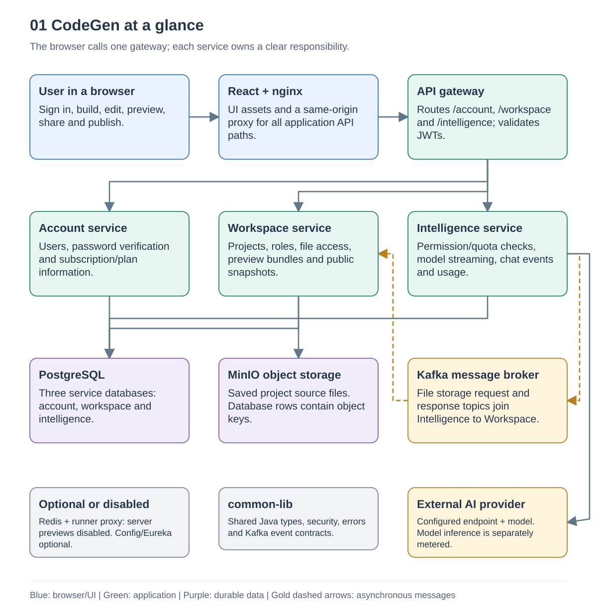
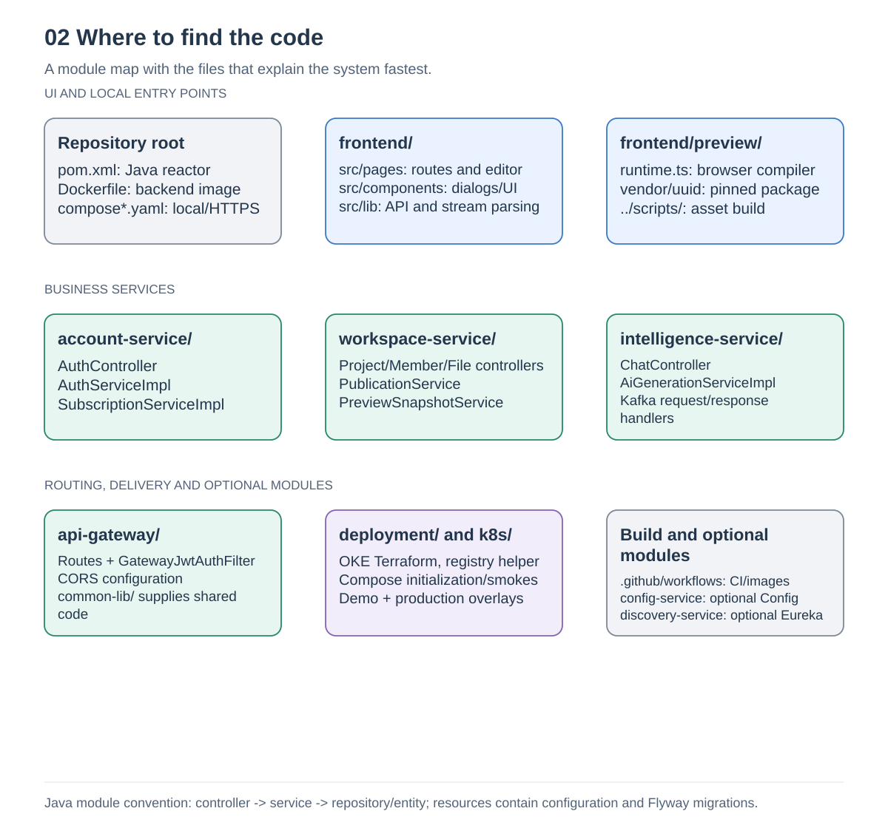

# Architecture and flow guide

CodeGen is an AI-assisted project builder. A signed-in user creates a project, asks for code, edits files, runs a browser preview, shares private access, and publishes a saved frontend snapshot.

This guide explains **the checked-in implementation at `a5f2276`**, inspected on 13 September 2026. It does not claim that a cloud endpoint is currently healthy or publicly reachable. The previous deployment checks and their limitations are recorded in [VALIDATION.md](https://github.com/Richa-2319/CodeGen-Ai-powered-project-builder/blob/a5f22762396594eb68ff7693cdecda1ea9e9c243/deployment/VALIDATION.md#L1).

## Start with the architecture pack

- [UI screenshot tour](../screenshots/README.md): 13 actual frontend captures with fictional demo data, including editing, preview, sharing and publication.
- [High Level Design](HIGH-LEVEL-DESIGN.md): requirements, boundaries, contracts, deployment, security, tradeoffs and engineering gaps.
- [Microservice dataflow](microservice-dataflow.md): labeled connections, exact internal API paths and Kafka payloads.
- [UML and engineering views](uml-and-engineering-views.md): actors, classes, sequences, state machines, activities, components and failure boundaries.
- [Kubernetes components](kubernetes-components.md): workloads, Services, storage, configuration, RBAC, networking and cluster platform components.

## Engineering coverage

| Engineering question | Diagram views |
| --- | --- |
| What is the system and how is source organized? | 01 overview, 02 repository/package map, 25 UML components |
| Who uses it and what can each role do? | 03 authentication, 04 project lifecycle, 08 sharing, 16 use cases |
| What data crosses service and storage boundaries? | 05 generation, 06 delivery, 13 component dataflow, 14 HTTP communication, 15 Kafka dataflow |
| What is the logical structure and data model? | 10 ER/data ownership, 17 UML domain classes |
| In what order do components interact? | 18 AI sequence, 19 publication sequence |
| What decisions and states exist? | 20 state machines, 21 activity/swimlanes |
| How do preview, publication and quotas work? | 07 preview, 09 publication, 12 usage |
| How is it delivered and deployed? | 11 build/release, 22 Kubernetes deployment, 26 cluster components |
| Where are trust, failure and recovery boundaries? | 23 security, 24 reliability; HLD operational and capacity sections |

This covers the engineering views relevant to the implemented project. Detailed performance timing, measured capacity and SLOs require runtime evidence; recommendations and unverified platform details are labeled in the HLD. Each page is readable independently and editable in the draw.io master.

## Read the diagrams

- Start with the two maps below, then follow the topic links.
- Blue means browser/UI, green means application logic, purple means durable data, gold means asynchronous/model work, and gray means optional/shared components.
- Numbered flow cards show the reading order. Arrows may turn right-to-left on the second row to keep each flow on one readable page.
- Click an embedded SVG to inspect its full-size, zoomable image. The editable draw.io file contains all 26 numbered pages.

**Editable source:** [Open or download the complete draw.io diagram set](diagrams/CodeGen-Architecture-and-Flows.drawio). Open that file in draw.io / [diagrams.net](https://app.diagrams.net/) and choose a numbered page tab. The SVGs below are readable exports; edit the `.drawio` source when changing the diagrams.

## All 26 diagrams

| Page | Diagram | Explanation |
| --- | --- | --- |
| 01 | [System overview](diagrams/01-overview.svg) | [Read the flow](README.md#1-system-overview) |
| 02 | [Repository map](diagrams/02-repository.svg) | [Read the flow](README.md#2-repository-map) |
| 03 | [Signup, login and request security](diagrams/03-authentication.svg) | [Read the flow](authentication-and-projects.md#3-signup-login-and-request-security) |
| 04 | [Project lifecycle](diagrams/04-project-lifecycle.svg) | [Read the flow](authentication-and-projects.md#4-project-lifecycle) |
| 05 | [From prompt to streamed text](diagrams/05-ai-generation.svg) | [Read the flow](ai-and-file-delivery.md#5-from-prompt-to-streamed-text) |
| 06 | [Generated files and reliable delivery](diagrams/06-file-delivery.svg) | [Read the flow](ai-and-file-delivery.md#6-from-generated-text-to-durable-project-files) |
| 07 | [Edit, save and preview](diagrams/07-editor-preview.svg) | [Read the flow](preview-and-publishing.md#7-edit-save-and-preview) |
| 08 | [Sharing and permissions](diagrams/08-sharing.svg) | [Read the flow](authentication-and-projects.md#8-sharing-and-permissions) |
| 09 | [Publish, republish and unpublish](diagrams/09-publication.svg) | [Read the flow](preview-and-publishing.md#9-publish-republish-and-unpublish) |
| 10 | [Data ownership](diagrams/10-data-model.svg) | [Read the flow](data-and-deployment.md#10-data-ownership) |
| 11 | [Build, release and deploy](diagrams/11-delivery-deployment.svg) | [Read the flow](data-and-deployment.md#11-build-release-and-deploy) |
| 12 | [Plans, quotas and usage](diagrams/12-plan-usage.svg) | [Read the flow](ai-and-file-delivery.md#12-plans-quotas-and-usage) |
| 13 | [Component dataflow](diagrams/13-component-dataflow.svg) | [Read the view](microservice-dataflow.md#13-full-component-dataflow) |
| 14 | [Microservice HTTP exchanges](diagrams/14-microservice-http-dataflow.svg) | [Read the view](microservice-dataflow.md#14-direct-microservice-http-exchanges) |
| 15 | [Kafka and storage dataflow](diagrams/15-kafka-storage-dataflow.svg) | [Read the view](microservice-dataflow.md#15-kafka-file-storage-and-result-dataflow) |
| 16 | [UML use cases and actors](diagrams/16-uml-use-cases.svg) | [Read the view](uml-and-engineering-views.md#16-uml-use-cases-and-actors) |
| 17 | [UML domain classes](diagrams/17-uml-domain-classes.svg) | [Read the view](uml-and-engineering-views.md#17-uml-domain-classes) |
| 18 | [UML AI generation sequence](diagrams/18-uml-ai-sequence.svg) | [Read the view](uml-and-engineering-views.md#18-uml-ai-generation-sequence) |
| 19 | [UML publication sequence](diagrams/19-uml-publish-sequence.svg) | [Read the view](uml-and-engineering-views.md#19-uml-publish-and-anonymous-read-sequence) |
| 20 | [UML state machines](diagrams/20-uml-state-machines.svg) | [Read the view](uml-and-engineering-views.md#20-uml-state-machines) |
| 21 | [UML activity and swimlanes](diagrams/21-uml-build-activity.svg) | [Read the view](uml-and-engineering-views.md#21-uml-activity-and-responsibility-lanes) |
| 22 | [Kubernetes deployment topology](diagrams/22-kubernetes-deployment.svg) | [Read the view](kubernetes-components.md#22-application-deployment-topology) |
| 23 | [Security and trust boundaries](diagrams/23-security-trust-boundaries.svg) | [Read the view](uml-and-engineering-views.md#23-trust-boundaries-and-security) |
| 24 | [Failure and recovery boundaries](diagrams/24-failure-recovery.svg) | [Read the view](uml-and-engineering-views.md#24-failure-and-recovery-boundaries) |
| 25 | [UML component dependencies](diagrams/25-uml-components.svg) | [Read the view](uml-and-engineering-views.md#25-uml-component-and-package-dependencies) |
| 26 | [Kubernetes platform components](diagrams/26-kubernetes-platform-components.svg) | [Read the view](kubernetes-components.md#26-cluster-platform-components) |

To edit, download the [complete draw.io file](diagrams/CodeGen-Architecture-and-Flows.drawio) and open it in draw.io. Keep the matching SVG export updated when changing a page so the GitHub guide stays in sync.

## 1. System overview

The React frontend sends same-origin API requests through nginx and the Spring Cloud Gateway. Account owns identity and plans; Workspace owns projects, files, membership and publication; Intelligence owns model requests, chat records and usage. Kafka moves generated-file requests and results between Intelligence and Workspace. MinIO holds file contents; PostgreSQL holds the application records.

The demo runs **nine steady components**: four Java applications, the frontend, PostgreSQL, Kafka, MinIO and Redis. A bucket-initialization job runs separately. Config Server and Eureka are retained modules but are omitted from the normal Compose/demo runtime. `common-lib` is a dependency, not a separately running service.

## 2. Repository map

| Folder or file | Responsibility | Start reading here |
| --- | --- | --- |
| `frontend/` | React screens, API client, streaming UI, editor and dialogs | [App.tsx](https://github.com/Richa-2319/CodeGen-Ai-powered-project-builder/blob/a5f22762396594eb68ff7693cdecda1ea9e9c243/frontend/src/App.tsx#L1); [ProjectView.tsx](https://github.com/Richa-2319/CodeGen-Ai-powered-project-builder/blob/a5f22762396594eb68ff7693cdecda1ea9e9c243/frontend/src/pages/ProjectView.tsx#L1) |
| `frontend/preview/` and `frontend/scripts/` | Isolated compiler/runtime, bundled preview packages and asset generation | [runtime.ts](https://github.com/Richa-2319/CodeGen-Ai-powered-project-builder/blob/a5f22762396594eb68ff7693cdecda1ea9e9c243/frontend/preview/runtime.ts#L1); [build-preview.mjs](https://github.com/Richa-2319/CodeGen-Ai-powered-project-builder/blob/a5f22762396594eb68ff7693cdecda1ea9e9c243/frontend/scripts/build-preview.mjs#L1) |
| `api-gateway/` | Route prefixes, JWT validation and external-route restrictions | [application.yaml](https://github.com/Richa-2319/CodeGen-Ai-powered-project-builder/blob/a5f22762396594eb68ff7693cdecda1ea9e9c243/api-gateway/src/main/resources/application.yaml#L1); [GatewayJwtAuthFilter.java](https://github.com/Richa-2319/CodeGen-Ai-powered-project-builder/blob/a5f22762396594eb68ff7693cdecda1ea9e9c243/api-gateway/src/main/java/com/project/distributed_codegen/api_gateway/filter/GatewayJwtAuthFilter.java#L1) |
| `account-service/` | Signup/login, user lookup, Free-plan fallback and optional Stripe integration | [AuthServiceImpl.java](https://github.com/Richa-2319/CodeGen-Ai-powered-project-builder/blob/a5f22762396594eb68ff7693cdecda1ea9e9c243/account-service/src/main/java/com/project/distributed_codegen/account_service/service/impl/AuthServiceImpl.java#L1); [SubscriptionServiceImpl.java](https://github.com/Richa-2319/CodeGen-Ai-powered-project-builder/blob/a5f22762396594eb68ff7693cdecda1ea9e9c243/account-service/src/main/java/com/project/distributed_codegen/account_service/service/impl/SubscriptionServiceImpl.java#L1) |
| `workspace-service/` | Project lifecycle, roles, metadata, MinIO, previews and publication | [ProjectServiceImpl.java](https://github.com/Richa-2319/CodeGen-Ai-powered-project-builder/blob/a5f22762396594eb68ff7693cdecda1ea9e9c243/workspace-service/src/main/java/com/project/distributed_codegen/workspace_service/service/impl/ProjectServiceImpl.java#L1); [PublicationService.java](https://github.com/Richa-2319/CodeGen-Ai-powered-project-builder/blob/a5f22762396594eb68ff7693cdecda1ea9e9c243/workspace-service/src/main/java/com/project/distributed_codegen/workspace_service/service/PublicationService.java#L1) |
| `intelligence-service/` | Spring AI streaming, read-files tool, parsing, usage and Kafka tracking | [AiGenerationServiceImpl.java](https://github.com/Richa-2319/CodeGen-Ai-powered-project-builder/blob/a5f22762396594eb68ff7693cdecda1ea9e9c243/intelligence-service/src/main/java/com/project/distributed_codegen/intelligence_service/service/impl/AiGenerationServiceImpl.java#L1) |
| `common-lib/` | Shared DTOs, events, enums, security filters and error responses | [SharedSecurityAutoConfiguration.java](https://github.com/Richa-2319/CodeGen-Ai-powered-project-builder/blob/a5f22762396594eb68ff7693cdecda1ea9e9c243/common-lib/src/main/java/com/project/distributed_codegen/common_lib/security/SharedSecurityAutoConfiguration.java#L1); [ProjectRole.java](https://github.com/Richa-2319/CodeGen-Ai-powered-project-builder/blob/a5f22762396594eb68ff7693cdecda1ea9e9c243/common-lib/src/main/java/com/project/distributed_codegen/common_lib/enums/ProjectRole.java#L1) |
| `config-service/`, `discovery-service/` | Optional Config Server and Eureka modules | [pom.xml](https://github.com/Richa-2319/CodeGen-Ai-powered-project-builder/blob/a5f22762396594eb68ff7693cdecda1ea9e9c243/pom.xml#L1) |
| `compose.yaml`, `compose.https.yaml`, `Dockerfile` | Single-host containers, startup dependencies and optional HTTPS | [compose.yaml](https://github.com/Richa-2319/CodeGen-Ai-powered-project-builder/blob/a5f22762396594eb68ff7693cdecda1ea9e9c243/compose.yaml#L1); [compose.https.yaml](https://github.com/Richa-2319/CodeGen-Ai-powered-project-builder/blob/a5f22762396594eb68ff7693cdecda1ea9e9c243/compose.https.yaml#L1) |
| `k8s/` | Infrastructure, service and stateful manifests; demo/production overlays; render/validation tooling | [README.md](https://github.com/Richa-2319/CodeGen-Ai-powered-project-builder/blob/a5f22762396594eb68ff7693cdecda1ea9e9c243/k8s/demo/README.md#L1); [README.md](https://github.com/Richa-2319/CodeGen-Ai-powered-project-builder/blob/a5f22762396594eb68ff7693cdecda1ea9e9c243/k8s/production/README.md#L1) |
| `deployment/` | Startup/smoke helpers, OKE Terraform, registry renewal and operational guides | [README.md](https://github.com/Richa-2319/CodeGen-Ai-powered-project-builder/blob/a5f22762396594eb68ff7693cdecda1ea9e9c243/deployment/README.md#L1); [README.md](https://github.com/Richa-2319/CodeGen-Ai-powered-project-builder/blob/a5f22762396594eb68ff7693cdecda1ea9e9c243/deployment/oci-oke/README.md#L1) |
| `.github/workflows/` | CI and manually triggered image publication | [ci.yml](https://github.com/Richa-2319/CodeGen-Ai-powered-project-builder/blob/a5f22762396594eb68ff7693cdecda1ea9e9c243/.github/workflows/ci.yml#L1); [release-images.yml](https://github.com/Richa-2319/CodeGen-Ai-powered-project-builder/blob/a5f22762396594eb68ff7693cdecda1ea9e9c243/.github/workflows/release-images.yml#L1) |

Java modules generally use `controller` for HTTP endpoints, `service` for behavior, `repository`/`entity` for persistence, `dto`/`mapper` for transport, and `security`/`config` for enforcement and wiring. `src/main/resources/db/migration` contains Flyway schema changes; `src/test` contains regression checks.

## Explore by topic

| Read next | Diagrams | Questions answered |
| --- | --- | --- |
| [Authentication and projects](authentication-and-projects.md) | 03, 04, 08 | How do login, project creation, permissions, sharing and deletion work? |
| [AI and file delivery](ai-and-file-delivery.md) | 05, 06, 12 | How does a prompt become streamed text, stored files and recorded usage? |
| [Preview and publishing](preview-and-publishing.md) | 07, 09 | What actually runs a preview, and what becomes public? |
| [Data and deployment](data-and-deployment.md) | 10, 11 | Which database owns each record, and how are images deployed? |

## Important distinctions

1. Streaming completion does **not** mean Kafka/MinIO storage has completed.
2. Browser preview and public snapshots use a client-side sandbox; the Kubernetes execution runner is disabled by default.
3. Sharing adds private membership. Publishing exposes a stored frontend snapshot without requiring login.
4. The current Editor role includes project deletion. Owner-only controls cover member management and publication.
5. Hosting, model-provider billing and the application's plan/usage display are separate concepts.
