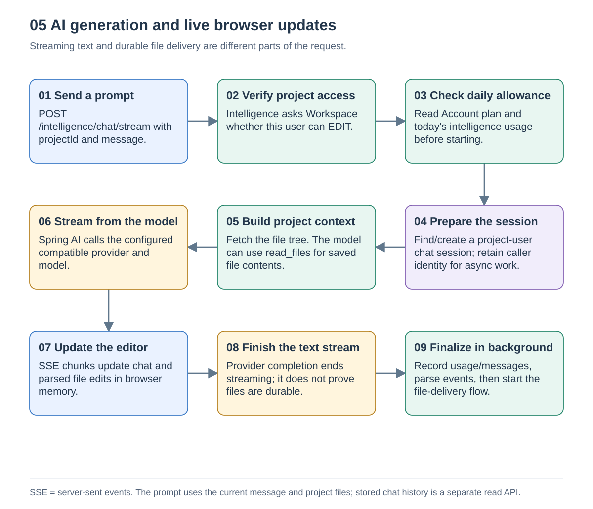
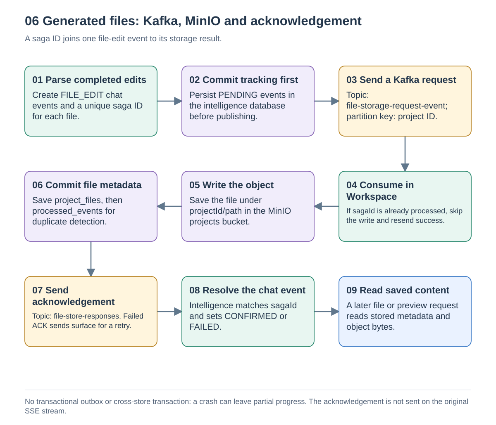
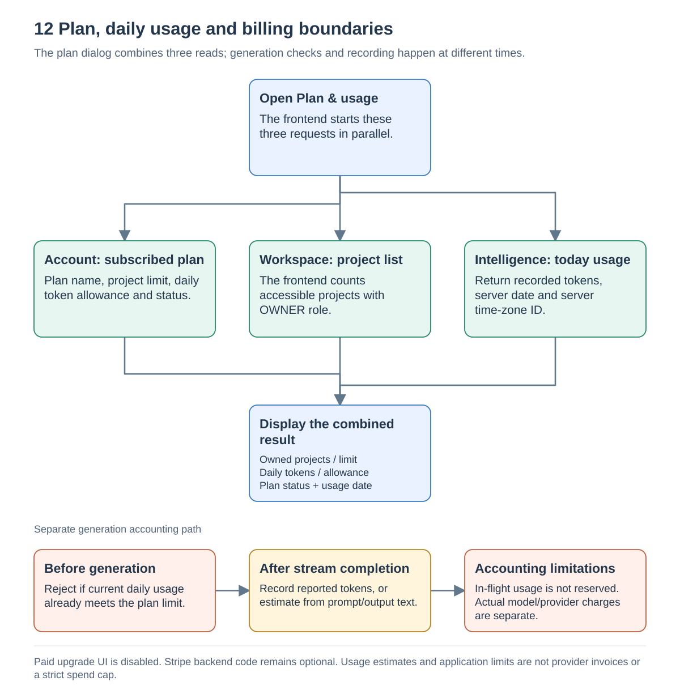

# AI and file delivery

Source snapshot: [`a5f2276`](https://github.com/Richa-2319/CodeGen-Ai-powered-project-builder/tree/a5f22762396594eb68ff7693cdecda1ea9e9c243), inspected on 13 September 2026.

## 5. From prompt to streamed text

`POST /intelligence/chat/stream` returns server-sent events (SSE), a response that sends chunks while the request remains open. Intelligence first asks Workspace for EDIT permission and Account for the caller's current plan. It checks today's recorded token usage before starting.

The service finds or creates a chat session keyed by `(projectId, userId)`. Spring AI builds a request from the system instructions, current user message and project file tree. The `read_files` tool can retrieve saved file contents through Workspace. The configured provider URL/model are runtime settings; the demonstrated OCI model was `openai.gpt-oss-120b`, but this guide does not inspect today's runtime configuration or model access.

The browser parses SSE chunks and completed file-edit markers, updating the chat, tree and recent file contents. Prior messages are saved for the chat-history API; the traced prompt path does not load that persisted history as model conversation memory.

When the provider completes, `doOnComplete` schedules finalization on a background worker. That work records token usage and chat messages, parses structured events, and publishes file-storage requests. The original SSE stream can finish before this work succeeds.

Sources: [ChatController.java](https://github.com/Richa-2319/CodeGen-Ai-powered-project-builder/blob/a5f22762396594eb68ff7693cdecda1ea9e9c243/intelligence-service/src/main/java/com/project/distributed_codegen/intelligence_service/controller/ChatController.java#L1), [AiGenerationServiceImpl.java](https://github.com/Richa-2319/CodeGen-Ai-powered-project-builder/blob/a5f22762396594eb68ff7693cdecda1ea9e9c243/intelligence-service/src/main/java/com/project/distributed_codegen/intelligence_service/service/impl/AiGenerationServiceImpl.java#L1), [FileTreeContextAdvisor.java](https://github.com/Richa-2319/CodeGen-Ai-powered-project-builder/blob/a5f22762396594eb68ff7693cdecda1ea9e9c243/intelligence-service/src/main/java/com/project/distributed_codegen/intelligence_service/llm/FileTreeContextAdvisor.java#L1), [CodeGenerationTools.java](https://github.com/Richa-2319/CodeGen-Ai-powered-project-builder/blob/a5f22762396594eb68ff7693cdecda1ea9e9c243/intelligence-service/src/main/java/com/project/distributed_codegen/intelligence_service/llm/CodeGenerationTools.java#L1), [stream-parser.ts](https://github.com/Richa-2319/CodeGen-Ai-powered-project-builder/blob/a5f22762396594eb68ff7693cdecda1ea9e9c243/frontend/src/lib/stream-parser.ts#L1), [api.ts](https://github.com/Richa-2319/CodeGen-Ai-powered-project-builder/blob/a5f22762396594eb68ff7693cdecda1ea9e9c243/frontend/src/lib/api.ts#L1).

## 6. From generated text to durable project files

Each parsed `FILE_EDIT` event receives a saga ID: a correlation identifier for that file operation. Intelligence commits its PENDING tracking record before sending `file-storage-request-event`. Messages use a project-based partition key.

Workspace consumes the request. A previously processed saga skips the write and resends a success acknowledgement. A new request writes source bytes into the MinIO `projects` bucket under `projectId/path`, saves `project_files` metadata, then saves a `processed_events` marker. The service returns success or failure on `file-store-responses`; a failed acknowledgement send is surfaced so the request can be retried.

Intelligence finds the event by saga ID and changes PENDING to CONFIRMED or FAILED. A later file read uses Workspace metadata to locate the object in MinIO. The ACK does not travel back on the already completed browser SSE stream.

| If this fails | Where the reader should look |
| --- | --- |
| No chat stream starts | Gateway authentication, Workspace permission call, Account plan call, provider access |
| Text appears but files are absent | Background finalization, PENDING events, request topic and Workspace consumer |
| File metadata exists but content cannot load | MinIO object access and the stored object key |
| Files exist but event remains PENDING | Response publication and Intelligence response consumer |
| Duplicate request arrives | `processed_events` lookup and repeated acknowledgement |

This is not an exactly-once transaction spanning PostgreSQL, Kafka and MinIO. There is no durable transactional outbox in this path. A crash after database commit but before Kafka publication, or between object and metadata operations, can leave partial progress. The current HTTP/SSE response does not certify durable completion.

Sources: [FileStorageRequestPublisher.java](https://github.com/Richa-2319/CodeGen-Ai-powered-project-builder/blob/a5f22762396594eb68ff7693cdecda1ea9e9c243/intelligence-service/src/main/java/com/project/distributed_codegen/intelligence_service/service/FileStorageRequestPublisher.java#L1), [FileStorageConsumer.java](https://github.com/Richa-2319/CodeGen-Ai-powered-project-builder/blob/a5f22762396594eb68ff7693cdecda1ea9e9c243/workspace-service/src/main/java/com/project/distributed_codegen/workspace_service/consumer/FileStorageConsumer.java#L1), [ProjectFileServiceImpl.java](https://github.com/Richa-2319/CodeGen-Ai-powered-project-builder/blob/a5f22762396594eb68ff7693cdecda1ea9e9c243/workspace-service/src/main/java/com/project/distributed_codegen/workspace_service/service/impl/ProjectFileServiceImpl.java#L1), [IntelligenceSagaResponseHandler.java](https://github.com/Richa-2319/CodeGen-Ai-powered-project-builder/blob/a5f22762396594eb68ff7693cdecda1ea9e9c243/intelligence-service/src/main/java/com/project/distributed_codegen/intelligence_service/consumer/IntelligenceSagaResponseHandler.java#L1), [FileStoreRequestEvent.java](https://github.com/Richa-2319/CodeGen-Ai-powered-project-builder/blob/a5f22762396594eb68ff7693cdecda1ea9e9c243/common-lib/src/main/java/com/project/distributed_codegen/common_lib/event/FileStoreRequestEvent.java#L1), [FileStoreResponseEvent.java](https://github.com/Richa-2319/CodeGen-Ai-powered-project-builder/blob/a5f22762396594eb68ff7693cdecda1ea9e9c243/common-lib/src/main/java/com/project/distributed_codegen/common_lib/event/FileStoreResponseEvent.java#L1).

## 12. Plans, quotas and usage

`PlanDialog` reads three APIs in parallel: Account subscription information, Workspace's accessible projects, and Intelligence's daily usage. The UI counts only projects where the caller is OWNER. Without an active relevant subscription, Account returns its built-in Free plan: three projects and 5,000 daily AI tokens. Those are application rules, not cloud-provider credits.

Before generation, Intelligence rejects a caller whose recorded daily usage already meets the allowance. After a completed response, it records provider token counts when available and estimates missing counts from prompt/output UTF-8 size. The date follows the service's system time zone, which the usage endpoint exposes.

The check does not reserve tokens for in-flight requests, so it is not a strict upper bound on a day's final usage or provider spend. The estimate does not capture every unreported provider/system/tool token. Paid upgrade controls are disabled; Stripe checkout/portal/webhook implementations remain optional backend code. No Stripe or OCI billing charge is implied merely by reading this dialog.

Sources: [PlanDialog.tsx](https://github.com/Richa-2319/CodeGen-Ai-powered-project-builder/blob/a5f22762396594eb68ff7693cdecda1ea9e9c243/frontend/src/components/PlanDialog.tsx#L1), [SubscriptionServiceImpl.java](https://github.com/Richa-2319/CodeGen-Ai-powered-project-builder/blob/a5f22762396594eb68ff7693cdecda1ea9e9c243/account-service/src/main/java/com/project/distributed_codegen/account_service/service/impl/SubscriptionServiceImpl.java#L1), [UsageServiceImpl.java](https://github.com/Richa-2319/CodeGen-Ai-powered-project-builder/blob/a5f22762396594eb68ff7693cdecda1ea9e9c243/intelligence-service/src/main/java/com/project/distributed_codegen/intelligence_service/service/impl/UsageServiceImpl.java#L1), [UsageController.java](https://github.com/Richa-2319/CodeGen-Ai-powered-project-builder/blob/a5f22762396594eb68ff7693cdecda1ea9e9c243/intelligence-service/src/main/java/com/project/distributed_codegen/intelligence_service/controller/UsageController.java#L1), [AiGenerationServiceImpl.java](https://github.com/Richa-2319/CodeGen-Ai-powered-project-builder/blob/a5f22762396594eb68ff7693cdecda1ea9e9c243/intelligence-service/src/main/java/com/project/distributed_codegen/intelligence_service/service/impl/AiGenerationServiceImpl.java#L179).

Return to [Architecture and flow guide](README.md).
