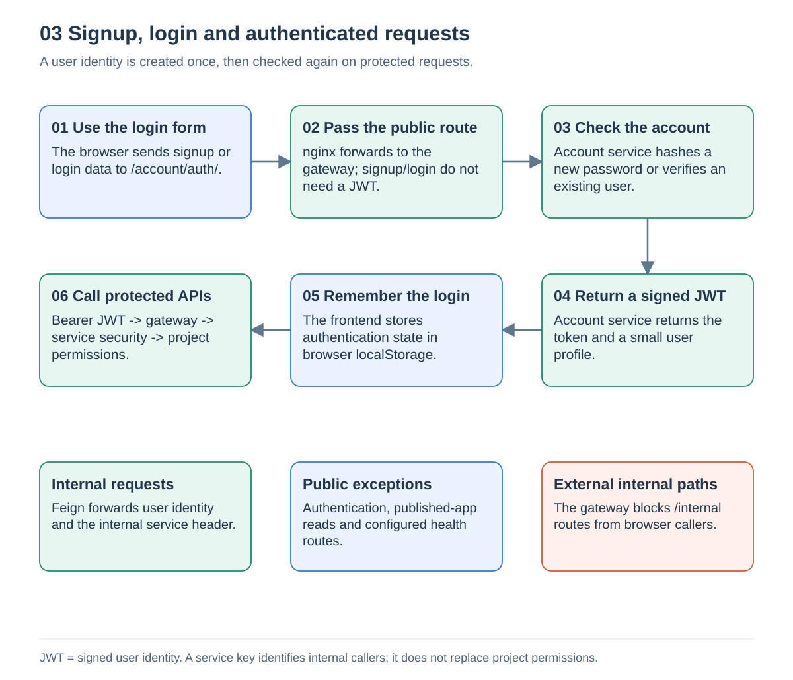
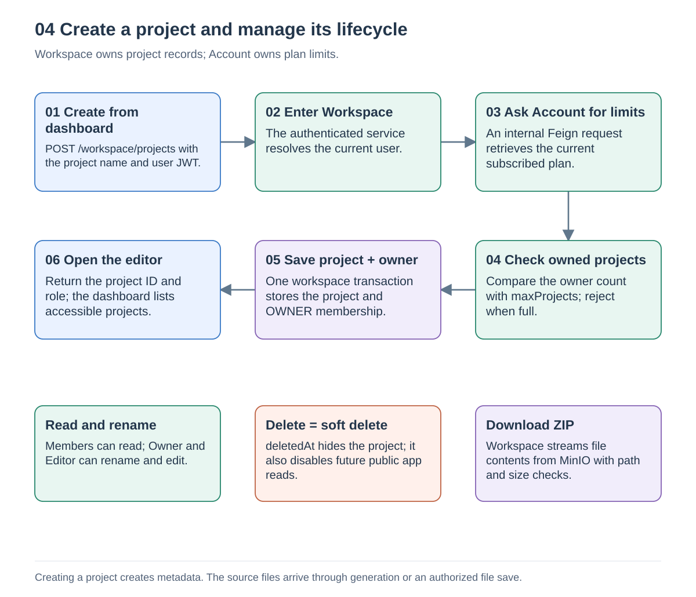
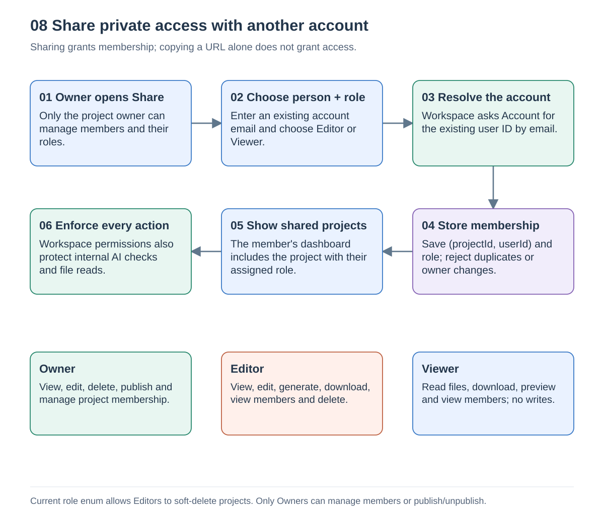

# Authentication and projects

Source snapshot: [`a5f2276`](https://github.com/Richa-2319/CodeGen-Ai-powered-project-builder/tree/a5f22762396594eb68ff7693cdecda1ea9e9c243), inspected on 13 September 2026.

## 3. Signup, login and request security

1. `/signup` and `/login` are React routes. The API client sends credentials to `/account/auth/signup` or `/account/auth/login`.
2. nginx forwards the request to the application gateway. Those authentication routes are public exceptions.
3. Signup checks the username, hashes the password and saves a user. Login uses Spring's authentication manager to verify an existing user.
4. Account returns a signed JWT and profile. The browser retains them in `localStorage`; later protected requests carry `Authorization: Bearer ...`.
5. The gateway checks the JWT and rejects externally addressed internal routes. Backend security establishes the user principal and checks permissions for the operation.

Internal Feign calls use service DNS/URLs with `/account` or `/workspace` context paths. Shared security adds the internal service header and propagates the caller's JWT. AI work crosses thread boundaries, so its file-tree advisor and `read_files` tool receive the caller authorization explicitly. Authentication identifies the user; it does not grant access to every project.

Sources: [AuthServiceImpl.java](https://github.com/Richa-2319/CodeGen-Ai-powered-project-builder/blob/a5f22762396594eb68ff7693cdecda1ea9e9c243/account-service/src/main/java/com/project/distributed_codegen/account_service/service/impl/AuthServiceImpl.java#L1), [GatewayJwtAuthFilter.java](https://github.com/Richa-2319/CodeGen-Ai-powered-project-builder/blob/a5f22762396594eb68ff7693cdecda1ea9e9c243/api-gateway/src/main/java/com/project/distributed_codegen/api_gateway/filter/GatewayJwtAuthFilter.java#L1), [SharedSecurityAutoConfiguration.java](https://github.com/Richa-2319/CodeGen-Ai-powered-project-builder/blob/a5f22762396594eb68ff7693cdecda1ea9e9c243/common-lib/src/main/java/com/project/distributed_codegen/common_lib/security/SharedSecurityAutoConfiguration.java#L1), [api.ts](https://github.com/Richa-2319/CodeGen-Ai-powered-project-builder/blob/a5f22762396594eb68ff7693cdecda1ea9e9c243/frontend/src/lib/api.ts#L1).

## 4. Project lifecycle

Workspace checks the user's current Account plan before allowing project creation. It compares the allowed count with owned projects, then saves the project and OWNER membership inside its transaction. Project creation alone does not generate source files. The dashboard queries accessible projects together with the caller's role.

Members may read project details. Owners and Editors may rename/edit and, under the current permission enum, soft-delete a project. Soft deletion sets `deletedAt`; it is not a database/object-storage purge. Permission checks and public-app lookup exclude deleted projects. ZIP download streams source bytes from MinIO through Workspace, with path normalization, duplicate-path, file-count and total-size checks.

Sources: [ProjectServiceImpl.java](https://github.com/Richa-2319/CodeGen-Ai-powered-project-builder/blob/a5f22762396594eb68ff7693cdecda1ea9e9c243/workspace-service/src/main/java/com/project/distributed_codegen/workspace_service/service/impl/ProjectServiceImpl.java#L1), [FileController.java](https://github.com/Richa-2319/CodeGen-Ai-powered-project-builder/blob/a5f22762396594eb68ff7693cdecda1ea9e9c243/workspace-service/src/main/java/com/project/distributed_codegen/workspace_service/controller/FileController.java#L1), [ProjectFileServiceImpl.java](https://github.com/Richa-2319/CodeGen-Ai-powered-project-builder/blob/a5f22762396594eb68ff7693cdecda1ea9e9c243/workspace-service/src/main/java/com/project/distributed_codegen/workspace_service/service/impl/ProjectFileServiceImpl.java#L1), [SecurityExpressions.java](https://github.com/Richa-2319/CodeGen-Ai-powered-project-builder/blob/a5f22762396594eb68ff7693cdecda1ea9e9c243/workspace-service/src/main/java/com/project/distributed_codegen/workspace_service/security/SecurityExpressions.java#L1).

## 8. Sharing and permissions

The owner enters an existing CodeGen account email and selects Editor or Viewer. Workspace resolves the user through Account, rejects duplicate memberships, and saves the project/user role. There is no automatic invitation email: the account must already exist. The project then appears in the member's dashboard. Copying a private project link alone does not grant access.

Only the owner can add/remove members or change roles. The service rejects attempts to assign OWNER through sharing, demote the owner or remove the owner. Removing a collaborator removes their membership-based access.

| Capability | Owner | Editor | Viewer | Anonymous |
| --- | --- | --- | --- | --- |
| Read private files, preview and download | Yes | Yes | Yes | No |
| View membership | Yes | Yes | Yes | No |
| Save, rename and generate code | Yes | Yes | No | No |
| Soft-delete project | Yes | **Yes in current code** | No | No |
| Manage members | Yes | No | No | No |
| Publish / republish / unpublish | Yes | No | No | No |
| Read an active public snapshot | Yes | Yes | Yes | Yes |

The Editor deletion permission is current behavior from `ProjectRole`, not an assumed product policy. Publishing is guarded by the owner-level `MANAGE_MEMBERS` permission. Public snapshots are described in [Preview and publishing](preview-and-publishing.md).

Sources: [ProjectRole.java](https://github.com/Richa-2319/CodeGen-Ai-powered-project-builder/blob/a5f22762396594eb68ff7693cdecda1ea9e9c243/common-lib/src/main/java/com/project/distributed_codegen/common_lib/enums/ProjectRole.java#L1), [ProjectMemberServiceImpl.java](https://github.com/Richa-2319/CodeGen-Ai-powered-project-builder/blob/a5f22762396594eb68ff7693cdecda1ea9e9c243/workspace-service/src/main/java/com/project/distributed_codegen/workspace_service/service/impl/ProjectMemberServiceImpl.java#L1), [PublicationController.java](https://github.com/Richa-2319/CodeGen-Ai-powered-project-builder/blob/a5f22762396594eb68ff7693cdecda1ea9e9c243/workspace-service/src/main/java/com/project/distributed_codegen/workspace_service/controller/PublicationController.java#L1), [SecurityExpressions.java](https://github.com/Richa-2319/CodeGen-Ai-powered-project-builder/blob/a5f22762396594eb68ff7693cdecda1ea9e9c243/intelligence-service/src/main/java/com/project/distributed_codegen/intelligence_service/security/SecurityExpressions.java#L1).

## Main API routes

The frontend keeps these same-origin prefixes intact; the backend servlet context path is part of each service URL.

| Operation | API |
| --- | --- |
| Signup / login | `POST /account/auth/signup`, `POST /account/auth/login` |
| List / create projects | `GET` / `POST /workspace/projects` |
| Read / rename / soft-delete | `GET` / `PATCH` / `DELETE /workspace/projects/{id}` |
| Member list / addition | `GET` / `POST /workspace/projects/{id}/members` |
| Change role / remove | `PATCH` / `DELETE /workspace/projects/{id}/members/{userId}` |
| File tree / content / save | `GET .../files`, `GET .../files/content?path=...`, `PUT .../files/content` |
| Download saved sources | `GET /workspace/projects/{id}/files/download-zip` |

Source: [api.ts](https://github.com/Richa-2319/CodeGen-Ai-powered-project-builder/blob/a5f22762396594eb68ff7693cdecda1ea9e9c243/frontend/src/lib/api.ts#L1).

Return to [Architecture and flow guide](README.md).
