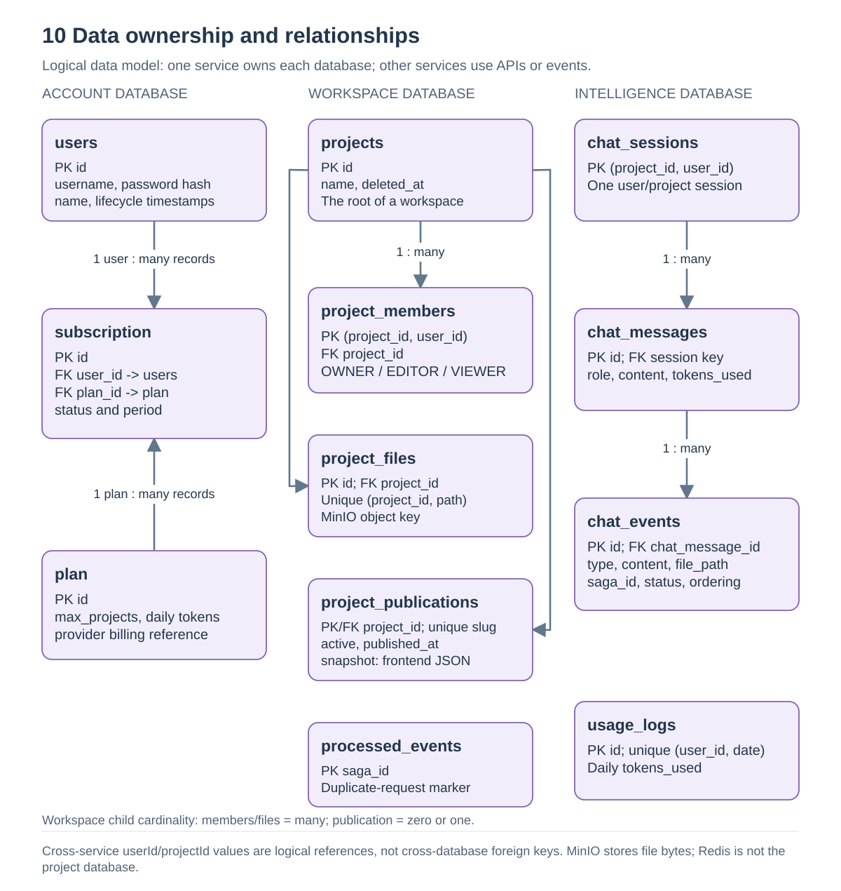
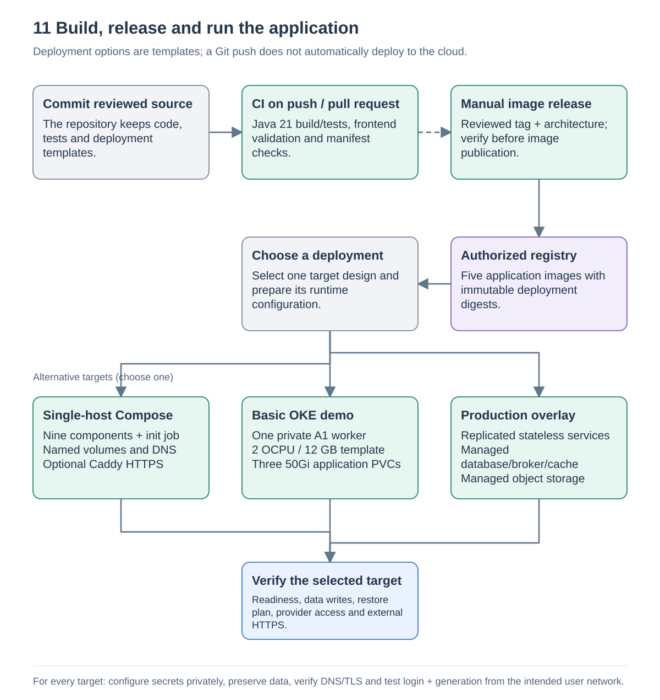

# Data and deployment

Source snapshot: [`a5f2276`](https://github.com/Richa-2319/CodeGen-Ai-powered-project-builder/tree/a5f22762396594eb68ff7693cdecda1ea9e9c243), inspected on 13 September 2026.

## 10. Data ownership

The demo uses one PostgreSQL server with three service-owned databases. Services exchange HTTP/API data or Kafka events instead of joining each other's database tables. `common-lib` shares contracts; it does not turn the databases into one shared schema.

| Store | What it owns | Key relationships |
| --- | --- | --- |
| Account DB | `users`, `plan`, `subscription` | Subscriptions reference an Account user and plan |
| Workspace DB | `projects`, `project_members`, `project_files`, `project_publications`, `processed_events` | A project has many members/files, zero or one publication; saga IDs track handled requests |
| Intelligence DB | `chat_sessions`, `chat_messages`, `chat_events`, `usage_logs` | Sessions use project/user key; messages belong to sessions, events to messages; one usage row per user/day |
| MinIO | Project file bytes | `project_files.minio_object_key` locates `projectId/path` |
| Kafka | File request/response messages | Project partition key and saga correlation ID |
| Redis | Optional server-preview domain routing | Not the source of project/account/chat persistence |

Workspace membership `user_id` and Intelligence's `project_id`/`user_id` are logical cross-service references. They are not foreign keys into another service's database. The SQL migrations show actual foreign keys within each database. `project_publications.snapshot` stores a frozen frontend bundle; it does not point at mutable live file contents.

Flyway creates or evolves the schemas when services start. The PostgreSQL initialization helper creates distinct service databases/owners for an empty local database installation. MinIO initialization creates the projects bucket. These startup helpers do not reset existing data on normal startup.

Sources: [V1__create_account_schema.sql](https://github.com/Richa-2319/CodeGen-Ai-powered-project-builder/blob/a5f22762396594eb68ff7693cdecda1ea9e9c243/account-service/src/main/resources/db/migration/V1__create_account_schema.sql#L1), [V1__create_workspace_schema.sql](https://github.com/Richa-2319/CodeGen-Ai-powered-project-builder/blob/a5f22762396594eb68ff7693cdecda1ea9e9c243/workspace-service/src/main/resources/db/migration/V1__create_workspace_schema.sql#L1), [V2__add_project_publications.sql](https://github.com/Richa-2319/CodeGen-Ai-powered-project-builder/blob/a5f22762396594eb68ff7693cdecda1ea9e9c243/workspace-service/src/main/resources/db/migration/V2__add_project_publications.sql#L1), [V1__create_intelligence_schema.sql](https://github.com/Richa-2319/CodeGen-Ai-powered-project-builder/blob/a5f22762396594eb68ff7693cdecda1ea9e9c243/intelligence-service/src/main/resources/db/migration/V1__create_intelligence_schema.sql#L1), [postgres-init.sh](https://github.com/Richa-2319/CodeGen-Ai-powered-project-builder/blob/a5f22762396594eb68ff7693cdecda1ea9e9c243/deployment/postgres-init.sh#L1).

## 11. Build, release and deploy

The root Maven reactor builds seven modules on Java 21, including the shared library and optional Config/Eureka modules. The runtime application images are the gateway, account, workspace, intelligence and frontend. CI on push/pull request checks Java, frontend and rendered Kubernetes configuration. The separate image workflow is manually triggered with a reviewed release tag, registry namespace and architecture; it does not deploy to a cluster.

| Runtime choice | What the source supplies | What remains environment-specific |
| --- | --- | --- |
| Docker Compose | Service DNS, startup/readiness dependencies, PostgreSQL, Kafka, Redis, MinIO, bucket initialization and frontend | Protected runtime values, backups and host resources; Caddy/domain configuration for public HTTPS |
| Basic OKE demo | Single-replica applications, bundled dependencies, three 50Gi PVCs; Terraform selects one private A1 worker at 2 OCPU/12 GB | Account entitlement/capacity, registry access, DNS/TLS, worker images, IAM, ingress and data protection |
| Production overlay | Replicated stateless services, probes and deployment contracts | Managed database/broker/cache/object-storage endpoints, working backups, real capacity and rollout validation |

Compose exposes the frontend on loopback port 8088 by default; its HTTPS overlay can add Caddy on a confirmed host/domain. The OKE demo's generic ingress setup and a separately configured OCI API Gateway are alternative edge designs. The private operator state from an existing deployment is not included in this repository and should not be recreated from a diagram.

The demonstration Redis uses ephemeral storage in OKE, while Compose defines a Redis volume. PostgreSQL, Kafka and MinIO need durable data. One OKE worker is a single failure domain; application-level redundancy does not exist in that demo.

Sources: [pom.xml](https://github.com/Richa-2319/CodeGen-Ai-powered-project-builder/blob/a5f22762396594eb68ff7693cdecda1ea9e9c243/pom.xml#L1), [Dockerfile](https://github.com/Richa-2319/CodeGen-Ai-powered-project-builder/blob/a5f22762396594eb68ff7693cdecda1ea9e9c243/Dockerfile#L1), [compose.yaml](https://github.com/Richa-2319/CodeGen-Ai-powered-project-builder/blob/a5f22762396594eb68ff7693cdecda1ea9e9c243/compose.yaml#L1), [compose.https.yaml](https://github.com/Richa-2319/CodeGen-Ai-powered-project-builder/blob/a5f22762396594eb68ff7693cdecda1ea9e9c243/compose.https.yaml#L1), [ci.yml](https://github.com/Richa-2319/CodeGen-Ai-powered-project-builder/blob/a5f22762396594eb68ff7693cdecda1ea9e9c243/.github/workflows/ci.yml#L1), [release-images.yml](https://github.com/Richa-2319/CodeGen-Ai-powered-project-builder/blob/a5f22762396594eb68ff7693cdecda1ea9e9c243/.github/workflows/release-images.yml#L1), [kustomization.yaml](https://github.com/Richa-2319/CodeGen-Ai-powered-project-builder/blob/a5f22762396594eb68ff7693cdecda1ea9e9c243/k8s/demo/kustomization.yaml#L1), [cluster.tf](https://github.com/Richa-2319/CodeGen-Ai-powered-project-builder/blob/a5f22762396594eb68ff7693cdecda1ea9e9c243/deployment/oci-oke/cluster.tf#L1).

## Internal addressing

These are configured application defaults, not external URLs or guaranteed host port mappings:

| Process | Default listen port | Context / purpose |
| --- | ---: | --- |
| Frontend nginx | 8080 | UI and same-origin proxy |
| API gateway | 8080 | Routes the three service prefixes |
| Account | 9050 | `/account` |
| Workspace | 9020 | `/workspace` |
| Intelligence | 9030 | `/intelligence` |

Each container/pod has its own network identity, so two internal processes can use 8080 without binding the same host port. Compose/Kubernetes DNS names and configured service URLs connect them. Preserve context paths when configuring Feign clients and gateway routes.

Sources: [nginx.conf](https://github.com/Richa-2319/CodeGen-Ai-powered-project-builder/blob/a5f22762396594eb68ff7693cdecda1ea9e9c243/frontend/nginx.conf#L1), [application.yaml](https://github.com/Richa-2319/CodeGen-Ai-powered-project-builder/blob/a5f22762396594eb68ff7693cdecda1ea9e9c243/api-gateway/src/main/resources/application.yaml#L1), [application.yaml](https://github.com/Richa-2319/CodeGen-Ai-powered-project-builder/blob/a5f22762396594eb68ff7693cdecda1ea9e9c243/account-service/src/main/resources/application.yaml#L1), [application.yaml](https://github.com/Richa-2319/CodeGen-Ai-powered-project-builder/blob/a5f22762396594eb68ff7693cdecda1ea9e9c243/workspace-service/src/main/resources/application.yaml#L1), [application.yaml](https://github.com/Richa-2319/CodeGen-Ai-powered-project-builder/blob/a5f22762396594eb68ff7693cdecda1ea9e9c243/intelligence-service/src/main/resources/application.yaml#L1).

## Operational reading order

For a failure, trace the narrowest relevant flow: browser/API response -> gateway route/authentication -> responsible service -> its dependency. For missing generated files, inspect the two Kafka topics and saga tracking as described in [AI and file delivery](ai-and-file-delivery.md). For preview failures, separate bundle retrieval from browser compilation. For public access, verify DNS/TCP/TLS from outside the operator network before diagnosing a React route.

Keep credentials, SSH keys, actual environment values, kubeconfig and Terraform state outside version control and outside these diagrams. A deployment needs independent public-reachability, provider, persistence and restore checks. Source diagrams and passing unit tests alone do not establish uptime or six months of free hosting.

The checked-in validation report records the previous local checks (43 Java, 17 frontend and 10 manifest tests) and historical deployment limitations. This documentation task did not rerun the application or change cloud resources. Source: [VALIDATION.md](https://github.com/Richa-2319/CodeGen-Ai-powered-project-builder/blob/a5f22762396594eb68ff7693cdecda1ea9e9c243/deployment/VALIDATION.md#L1).

Return to [Architecture and flow guide](README.md).
