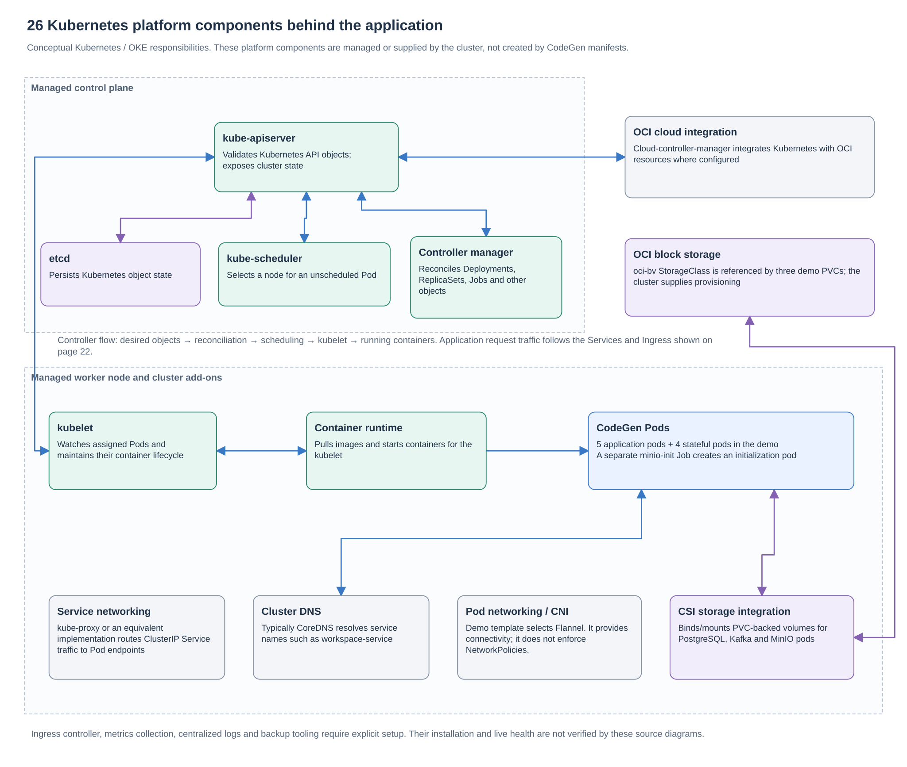

# Kubernetes components and deployment

This guide answers **which Kubernetes objects the project uses, what each does, and what the cluster must provide**. Application facts describe source [`a5f2276`](https://github.com/Richa-2319/CodeGen-Ai-powered-project-builder/tree/a5f22762396594eb68ff7693cdecda1ea9e9c243). Platform explanations are conceptual, not a live inventory or proof that an add-on is installed.

## 22. Application deployment topology

The demo overlay places five application Deployments and four StatefulSets in `codegen-core`, each at one replica: **nine steady pods**. `minio-init` runs as an additional Job. The Terraform template supplies one private A1 worker with 2 OCPU, 12 GB RAM and a 50 GB boot volume. PostgreSQL, Kafka and MinIO request three separate 50 GiB PVCs. Redis is ephemeral in this demo.

### Application workload and Service inventory

| Kubernetes workload | What runs inside | Service port → container port | Storage / dependency |
| --- | --- | --- | --- |
| Deployment `codegen-frontend` | nginx plus built React/sandbox assets | 80 → 8080 | Static image contents |
| Deployment `api-gateway` | Spring Cloud Gateway | 80 → 8080 | Routes to application Services |
| Deployment `account-service` | Identity, plans and user lookup | 80 → 9050 | `account_db` |
| Deployment `workspace-service` | Projects, files, membership and snapshots | 80 → 9020 | `workspace_db`, MinIO; optional runner route cache |
| Deployment `intelligence-service` | AI orchestration, chats, usage and file events | 80 → 9030 | `intelligence_db`, Kafka and model provider |
| StatefulSet `pgvector` | PostgreSQL 16 image | 5432 | One 50 GiB PVC; three logical databases |
| StatefulSet `kafka` | Kafka broker/controller | 9092; controller 29093 | One 50 GiB PVC |
| StatefulSet `minio` | S3-compatible object storage | 9000; console 9001 | One 50 GiB PVC |
| StatefulSet `redis` | Optional route cache | 6379 | 256 MiB `emptyDir`; no persistence in demo |
| Job `minio-init` | Bucket initialization | No inbound Service | Creates the projects bucket |

The table's ports describe internal communication. They are not a list of ports to expose to the internet. Application and MinIO Services use ClusterIP; PostgreSQL, Kafka and Redis use headless DNS. Kafka publishes its address before readiness for bootstrap. The PostgreSQL Service is named `pgvector`; the current application schema does not require vector tables.

### Supporting Kubernetes objects

| Object | Project-specific role | Defined here or supplied elsewhere? |
| --- | --- | --- |
| Namespace | `codegen-core` groups active workloads; `codegen-previews` is retained for the optional runner | [Namespace manifests](../../k8s/infra/namespaces.yaml) |
| Deployment | Desired app image, replica count, rollout and pod template | [Five active app manifests](../../k8s/services/kustomization.yaml) |
| ReplicaSet | Maintains Pods for a Deployment revision | Created by Kubernetes from Deployments; not hand-authored here |
| Pod | Container, environment, resource requests/limits, probes and mounts | Generated from Deployment, StatefulSet or Job templates |
| StatefulSet | Stable dependency pod identity and storage association | [Stateful manifests](../../k8s/stateful/kustomization.yaml) |
| Service / EndpointSlice | Stable cluster address plus the selected backend endpoints | Services are declared; endpoint state is maintained by Kubernetes |
| Ingress | Frontend host → frontend Service; API host → gateway Service | [Ingress manifest](../../k8s/infra/ingress.yaml); controller/DNS/TLS setup is external |
| ConfigMap | Shared host, CORS, preview and service configuration | [Kustomize generators](../../k8s/infra/kustomization.yaml) and workload manifests |
| Secret | Application/dependency credentials, runtime endpoints and TLS references | Created privately for the installation; templates reference them without embedding real values |
| Job | Initialize the MinIO bucket | [minio-init](../../k8s/demo/minio-init.yaml) |
| PVC / PV | Claim and bind durable PostgreSQL, Kafka and MinIO storage | Claims in StatefulSets; volumes are provisioned by the cluster's storage integration |
| StorageClass | `oci-bv` selects OCI block-volume provisioning | Referenced by [demo patches](../../k8s/demo/kustomization.yaml); not created by this app |
| `emptyDir` | Temporary Redis data and selected pod working directories | Declared in pod templates; not durable across pod replacement |
| ServiceAccount | Kubernetes identity used by Workspace | `workspace-service-account` in the [Workspace manifest](../../k8s/services/workspace-service.yaml) |
| Role / RoleBinding | Preview-management permissions in `codegen-previews` | Retained in Workspace YAML although execution is disabled; a least-privilege follow-up |
| NetworkPolicy | Intended ingress controls around core/preview traffic | [Core policies](../../k8s/infra/core-network-policies.yaml) included; preview policy excluded from active overlays; demo Flannel does not enforce policies |
| PodDisruptionBudget | Limits voluntary application disruption | [Five PDBs](../../k8s/infra/pod-disruption-budgets.yaml); base/production `minAvailable: 1`, demo `0` |
| Probes | Startup, readiness and liveness checks | Application pod specs; readiness affects Service endpoint eligibility |
| Resource requests / limits | Scheduler reservations and container execution limits | Pod specs; do not establish tested capacity or autoscaling |
| Kustomization | Compose resources, patches, host replacements and replica settings | A build-time manifest configuration, not an extra running pod |

Sources: [demo overlay](../../k8s/demo/kustomization.yaml), [demo capacity notes](../../k8s/demo/README.md), [production overlay](../../k8s/production/kustomization.yaml), [OKE cluster template](../../deployment/oci-oke/cluster.tf).

## 26. Cluster platform components

The control plane coordinates desired state; worker components run the assigned containers. Managed OKE supplies the control plane. The diagram explains responsibilities rather than naming observed running system pods. [Kubernetes components](https://kubernetes.io/docs/concepts/overview/components/), [OKE cluster and node concepts](https://docs.oracle.com/en-us/iaas/Content/ContEng/Concepts/contengclustersnodes.htm).

| Platform component | Role in running CodeGen |
| --- | --- |
| `kube-apiserver` | Accepts authorized Kubernetes object operations and exposes cluster state. |
| `etcd` | Stores Kubernetes object state; it is separate from CodeGen's PostgreSQL business data. |
| `kube-scheduler` | Selects a suitable worker for an unscheduled pod. |
| Controller manager | Reconciles workload objects, replicas and jobs toward desired state. |
| Cloud-controller integration | Connects supported Kubernetes operations with OCI resources where configured. |
| `kubelet` | Maintains the assigned pod/container lifecycle on a worker. |
| Container runtime | Pulls and runs container images. |
| Service networking | `kube-proxy` or an equivalent implementation routes Service traffic to endpoints. |
| Cluster DNS | Typically CoreDNS; resolves service names used in application configuration. |
| CNI / pod network | Connects pods; this OKE template selects Flannel. |
| CSI / storage integration | Provisions, attaches and mounts storage requested by supported PVCs. |

The basic component roles follow the [Kubernetes architecture reference](https://kubernetes.io/docs/concepts/architecture/). The exact runtime, add-on versions, system namespaces and health require a live inventory; they are not established by these source documents.

### Components that require a separate setup decision

- An Ingress resource needs a compatible controller and a working public network/DNS/TLS route. The OKE Terraform does not create the optional OCI API Gateway/load balancer.
- HPA, cluster autoscaling, topology placement rules and resilient managed dependencies are not provisioned by the current application overlays.
- Metrics collection, dashboards, alert routing, centralized logs and backup/restore tooling require operational setup. Exposing a health/metrics endpoint does not install that stack.
- The server-preview runner/proxy resources and Config Server are excluded from the active service sets. Browser previews do not create Kubernetes workloads.

### Demo versus production

| Concern | Self-contained demo | Production application overlay |
| --- | --- | --- |
| Application replicas | Five Deployments ×1 | Five Deployments ×2 |
| Stateful dependencies | Bundled PostgreSQL, Kafka, MinIO and Redis | Bundled StatefulSets excluded; external dependencies required |
| Durable storage | Three 50 GiB `oci-bv` claims | Supplied by the selected dependency platform |
| Node availability | Terraform example has one worker | More replicas need suitable placement and enough workers; overlay alone does not create this |
| Network controls | Flannel connectivity; policies are not enforced | Choose and verify a policy-enforcing network implementation |
| Readiness for public use | Source template and historical tests | Fresh public access, load, security and restore validation required |

Return to the [HLD](HIGH-LEVEL-DESIGN.md) or [complete diagram index](README.md).
