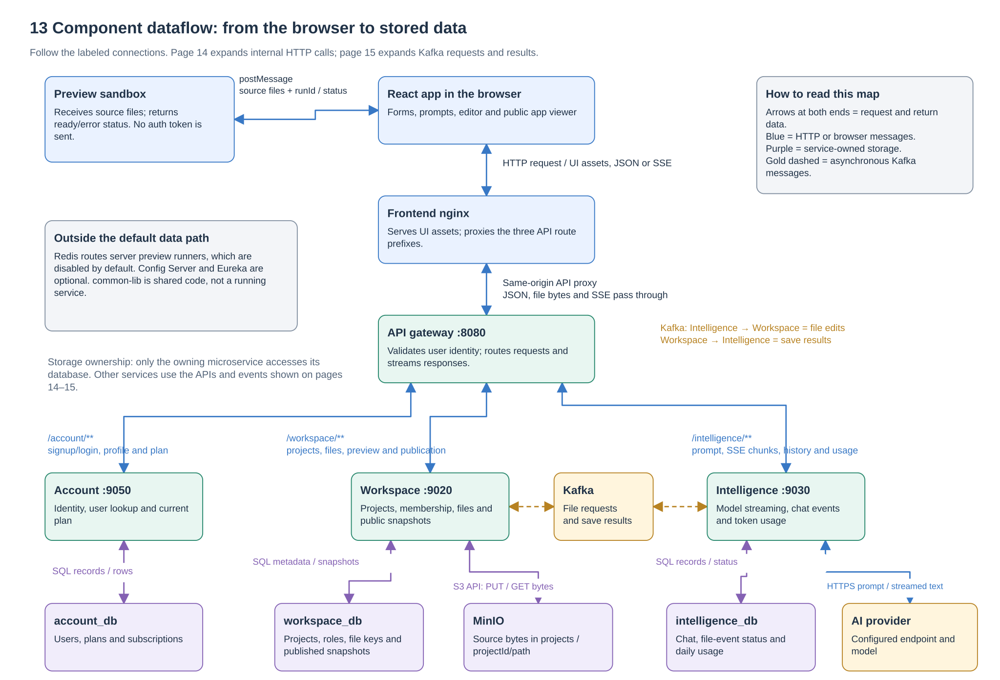
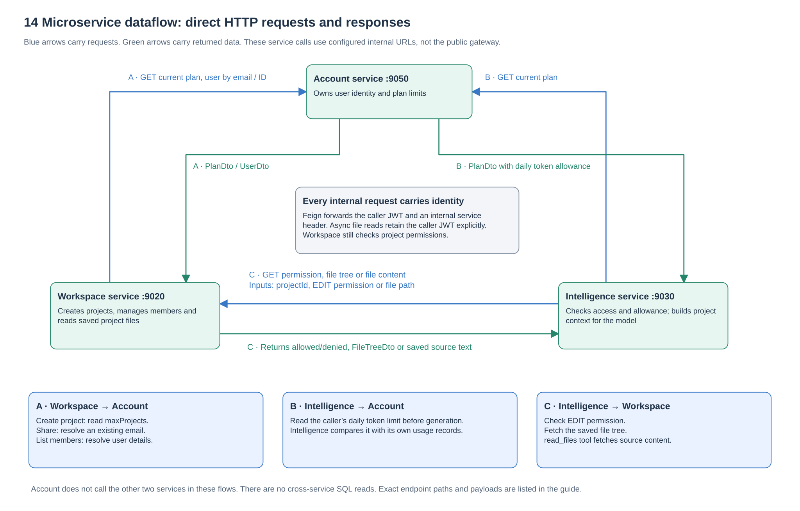
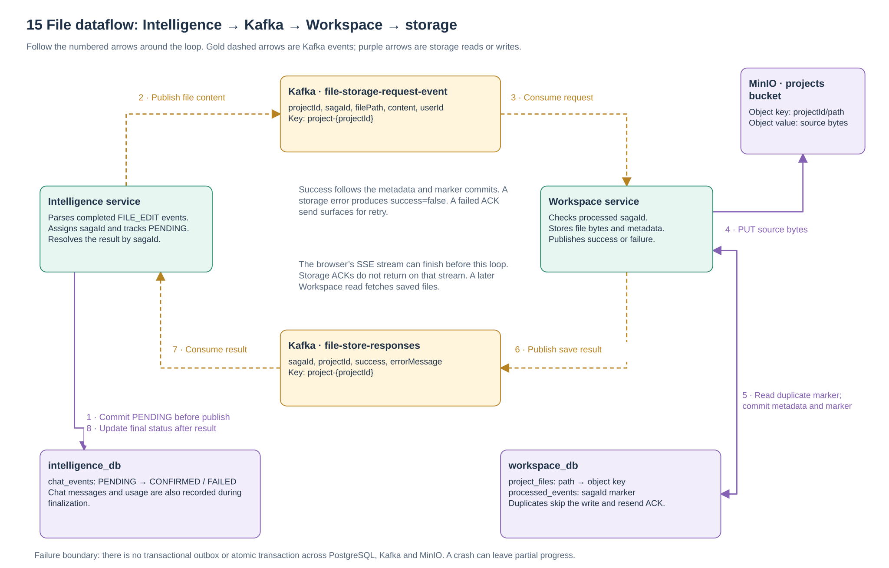

# Microservice and component dataflow

Start here to understand **who sends data to whom, what is sent, and where it is stored**. These views describe application source [`a5f2276`](https://github.com/Richa-2319/CodeGen-Ai-powered-project-builder/tree/a5f22762396594eb68ff7693cdecda1ea9e9c243), not a live network inspection.

## 13. Full component dataflow

The browser talks to frontend nginx. nginx serves UI assets and proxies `/account`, `/workspace` and `/intelligence` to the API gateway. The gateway forwards requests to the matching service and returns its response. JSON, file bytes and server-sent events (SSE) all use this return path.

Each service reads and writes its own logical PostgreSQL database. Workspace additionally owns file content in MinIO. Intelligence calls the configured model provider. File edits cross from Intelligence to Workspace through Kafka; the save result returns through another Kafka topic. Preview execution stays in a browser sandbox that receives file data, not account credentials.

Arrows at both ends on this overview represent request and returned data. The two following views separate the directional exchanges in detail.

## 14. Direct microservice HTTP exchanges

| Flow | Caller → receiver | Endpoint and request input | Returned data / purpose |
| --- | --- | --- | --- |
| A1 | Workspace → Account | `GET /account/internal/v1/billing/current-plan`; authenticated caller | `PlanDto`; compare `maxProjects` before project creation |
| A2 | Workspace → Account | `GET /account/internal/v1/users/by-email?email=…` | Existing `UserDto`; resolve the person being granted membership |
| A3 | Workspace → Account | `GET /account/internal/v1/users/{id}` | `UserDto`; enrich the member list |
| B | Intelligence → Account | `GET /account/internal/v1/billing/current-plan`; authenticated caller | `PlanDto`; compare daily allowance with Intelligence's recorded usage |
| C1 | Intelligence → Workspace | `GET /workspace/internal/v1/projects/{projectId}/permissions/check?permission=EDIT` | Boolean permission result; generation rejects denied access |
| C2 | Intelligence → Workspace | `GET /workspace/internal/v1/projects/{projectId}/files/tree` | `FileTreeDto`; supply saved project structure as model context |
| C3 | Intelligence → Workspace | `GET /workspace/internal/v1/projects/{projectId}/files/content?path=…` | Saved source text for the model's `read_files` tool |

These calls use configured service URLs and platform DNS. They bypass the public gateway. Feign supplies an internal service header and the caller identity; asynchronous file-context reads explicitly retain authorization. The gateway blocks outside callers from using internal paths. The receiving service still enforces authorization; an internal header is not a replacement for project permissions.

The Intelligence Account client also declares a by-email lookup, but it is not part of the traced generation path and is omitted from the active-flow diagram.

Sources: [Workspace AccountClient](../../workspace-service/src/main/java/com/project/distributed_codegen/workspace_service/client/AccountClient.java), [Intelligence AccountClient](../../intelligence-service/src/main/java/com/project/distributed_codegen/intelligence_service/client/AccountClient.java), [Intelligence WorkspaceClient](../../intelligence-service/src/main/java/com/project/distributed_codegen/intelligence_service/client/WorkspaceClient.java), [shared security wiring](../../common-lib/src/main/java/com/project/distributed_codegen/common_lib/security/SharedSecurityAutoConfiguration.java), [gateway routes](../../api-gateway/src/main/resources/application.yaml).

## 15. Kafka, file storage and result dataflow

| Direction | Channel | Data carried |
| --- | --- | --- |
| Intelligence → Kafka → Workspace | `file-storage-request-event` | `projectId`, `sagaId`, `filePath`, `content`, `userId` |
| Workspace → MinIO | S3-compatible object PUT | Source bytes; object key `projectId/path` in the configured projects bucket |
| Workspace → workspace_db | SQL | `project_files` metadata and a `processed_events` saga marker |
| Workspace → Kafka → Intelligence | `file-store-responses` | `sagaId`, `projectId`, `success`, `errorMessage` |
| Intelligence → intelligence_db | SQL | `chat_events.status`: PENDING → CONFIRMED or FAILED |

Both topics use the key `project-{projectId}`. The saga ID correlates one file edit and its result. Intelligence commits tracking before it publishes. Workspace detects processed sagas and resends success without repeating the file write. A new save writes the object, file metadata and processed marker before sending success.

This loop is eventually consistent. The original SSE stream can close before storage finishes, and its response does not contain the storage ACK. There is no atomic transaction across the database, Kafka and MinIO, and no transactional outbox here. The [failure-boundary diagram](uml-and-engineering-views.md#24-failure-and-recovery-boundaries) shows where incomplete progress can remain.

Manual file saving follows a separate synchronous HTTP → Workspace → MinIO/metadata path. A published app reads a stored Workspace snapshot; it does not query the latest private files each time a visitor opens the link.

Sources: [request event](../../common-lib/src/main/java/com/project/distributed_codegen/common_lib/event/FileStoreRequestEvent.java), [response event](../../common-lib/src/main/java/com/project/distributed_codegen/common_lib/event/FileStoreResponseEvent.java), [request publisher](../../intelligence-service/src/main/java/com/project/distributed_codegen/intelligence_service/service/FileStorageRequestPublisher.java), [Workspace consumer](../../workspace-service/src/main/java/com/project/distributed_codegen/workspace_service/consumer/FileStorageConsumer.java), [response handler](../../intelligence-service/src/main/java/com/project/distributed_codegen/intelligence_service/consumer/IntelligenceSagaResponseHandler.java).

Continue with the [HLD](HIGH-LEVEL-DESIGN.md), [UML engineering views](uml-and-engineering-views.md), or [Kubernetes components](kubernetes-components.md). Return to the [complete diagram index](README.md).
