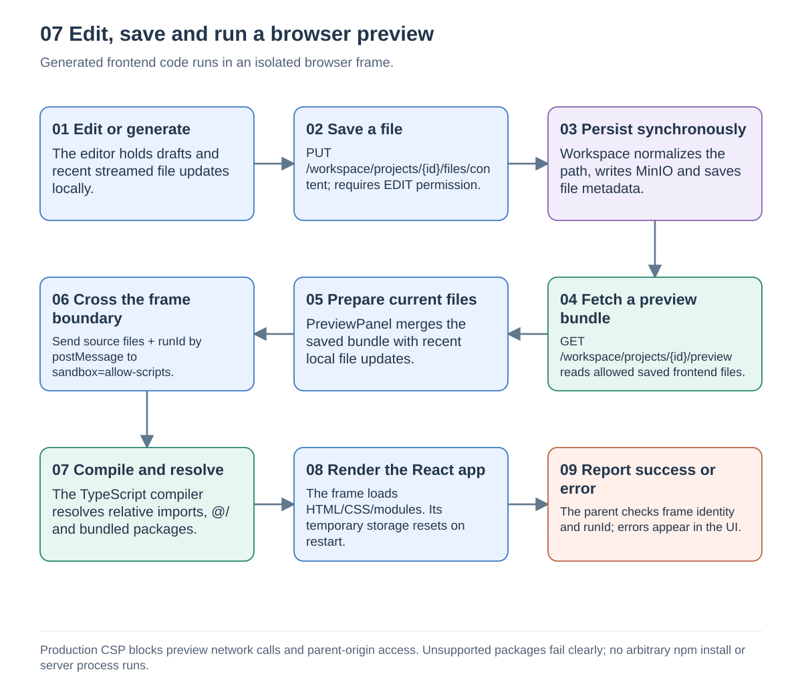
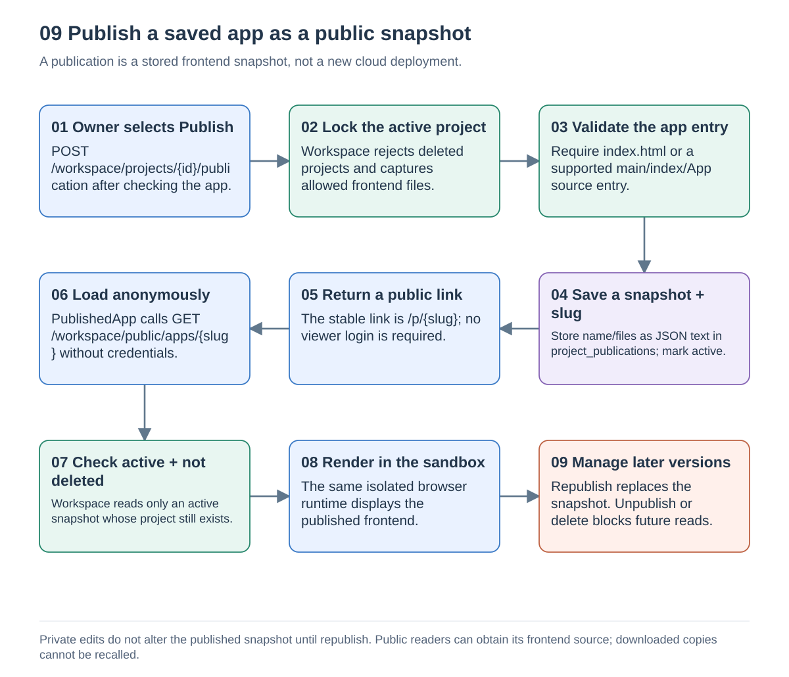

# Preview and publishing

Source snapshot: [`a5f2276`](https://github.com/Richa-2319/CodeGen-Ai-powered-project-builder/tree/a5f22762396594eb68ff7693cdecda1ea9e9c243), inspected on 13 September 2026.

## 7. Edit, save and preview

The code editor keeps drafts locally. Save sends a protected file-content PUT to Workspace. Workspace normalizes the relative path, writes MinIO and stores metadata; manual saves use this synchronous HTTP path rather than the AI Kafka path. Successful saves update the UI's recent file map and refresh the preview.

When streaming stops, `PreviewPanel` requests the saved preview bundle and merges recent local file updates. This explains why a preview can show recent streamed content before Kafka persistence is independently confirmed. A reload or another client still depends on the saved data.

`PreviewSnapshotService` reads allowed frontend files from MinIO. Its limits are 200 files, 1 MiB per file and 5 MiB total. It excludes hidden paths, generated dependency/build directories and configuration-style paths. This file selection is not a guarantee that arbitrary source text contains no secrets; users must not embed credentials in frontend source.

`SandboxPreview` loads `/preview/index.html` into an iframe with `sandbox="allow-scripts"`. It sends files and a run ID to that frame, never the editor's authentication state. The parent checks the exact frame reference, opaque origin and run ID when receiving status/errors. The TypeScript runtime resolves relative imports and `@/`, supplies bundled UI modules, applies supported styles and renders the selected entry point.

The production nginx preview policy blocks outgoing connections, parent-origin access, forms, nested frames and top-level navigation. Runtime-local substitutes for `localStorage` and `sessionStorage` disappear on restart. UUID, React, common UI packages, Tailwind and daisyUI are bundled; unsupported packages produce an error. Package installation, arbitrary backend processes and external APIs are not supported by this browser runtime.

Sources: [CodePanel.tsx](https://github.com/Richa-2319/CodeGen-Ai-powered-project-builder/blob/a5f22762396594eb68ff7693cdecda1ea9e9c243/frontend/src/components/CodePanel.tsx#L1), [PreviewPanel.tsx](https://github.com/Richa-2319/CodeGen-Ai-powered-project-builder/blob/a5f22762396594eb68ff7693cdecda1ea9e9c243/frontend/src/components/PreviewPanel.tsx#L1), [SandboxPreview.tsx](https://github.com/Richa-2319/CodeGen-Ai-powered-project-builder/blob/a5f22762396594eb68ff7693cdecda1ea9e9c243/frontend/src/components/SandboxPreview.tsx#L1), [runtime.ts](https://github.com/Richa-2319/CodeGen-Ai-powered-project-builder/blob/a5f22762396594eb68ff7693cdecda1ea9e9c243/frontend/preview/runtime.ts#L1), [nginx.conf](https://github.com/Richa-2319/CodeGen-Ai-powered-project-builder/blob/a5f22762396594eb68ff7693cdecda1ea9e9c243/frontend/nginx.conf#L1), [PreviewSnapshotService.java](https://github.com/Richa-2319/CodeGen-Ai-powered-project-builder/blob/a5f22762396594eb68ff7693cdecda1ea9e9c243/workspace-service/src/main/java/com/project/distributed_codegen/workspace_service/service/PreviewSnapshotService.java#L1).

## 9. Publish, republish and unpublish

Only the owner may publish. Workspace locks the active project, captures allowed saved frontend files and checks that there is an app entry. It stores the complete name/files bundle as JSON text in `project_publications`, together with a UUID slug, active flag and timestamp. This is distinct from the `projects.is_public` field.

The returned link is `/p/{slug}`. `PublishedApp` loads it without authentication by calling `/workspace/public/apps/{slug}`, then uses the same browser sandbox as private preview. Workspace serves only active publications whose project is not soft-deleted. Account details, memberships and chat history are not included in the snapshot.

Private edits do not change an existing publication. Republishing replaces the snapshot while retaining its slug. Unpublishing sets the publication inactive; soft-deleting the project also makes future anonymous reads fail. Neither action recalls source that someone already downloaded. Anyone who can load the public app can obtain its published frontend source.

Publishing here does not build a server image, allocate a VM, install packages or create a separate cloud application. A publicly reachable host is still required for other people to reach `/p/{slug}`.

Sources: [PublicationController.java](https://github.com/Richa-2319/CodeGen-Ai-powered-project-builder/blob/a5f22762396594eb68ff7693cdecda1ea9e9c243/workspace-service/src/main/java/com/project/distributed_codegen/workspace_service/controller/PublicationController.java#L1), [PublicationService.java](https://github.com/Richa-2319/CodeGen-Ai-powered-project-builder/blob/a5f22762396594eb68ff7693cdecda1ea9e9c243/workspace-service/src/main/java/com/project/distributed_codegen/workspace_service/service/PublicationService.java#L1), [V2__add_project_publications.sql](https://github.com/Richa-2319/CodeGen-Ai-powered-project-builder/blob/a5f22762396594eb68ff7693cdecda1ea9e9c243/workspace-service/src/main/resources/db/migration/V2__add_project_publications.sql#L1), [PublishedApp.tsx](https://github.com/Richa-2319/CodeGen-Ai-powered-project-builder/blob/a5f22762396594eb68ff7693cdecda1ea9e9c243/frontend/src/pages/PublishedApp.tsx#L1), [PublishDialog.tsx](https://github.com/Richa-2319/CodeGen-Ai-powered-project-builder/blob/a5f22762396594eb68ff7693cdecda1ea9e9c243/frontend/src/components/PublishDialog.tsx#L1).

## The separate Kubernetes runner is disabled

`KubernetesDeploymentServiceImpl` retains a different `/projects/{id}/deploy` path. If deliberately enabled, it would claim a runner pod, mirror files, start a development process and register a six-hour Redis route for the preview proxy. The default `app.preview.enabled=false` rejects that operation before claiming a runner. This path is not the implementation used by the working browser preview or public snapshot features.

Do not infer safe server execution from the presence of `runner-pool.yaml` or NetworkPolicy manifests. An isolated runner environment requires its own security, persistence and capacity validation.

Source: [KubernetesDeploymentServiceImpl.java](https://github.com/Richa-2319/CodeGen-Ai-powered-project-builder/blob/a5f22762396594eb68ff7693cdecda1ea9e9c243/workspace-service/src/main/java/com/project/distributed_codegen/workspace_service/service/impl/KubernetesDeploymentServiceImpl.java#L1); [index.js](https://github.com/Richa-2319/CodeGen-Ai-powered-project-builder/blob/a5f22762396594eb68ff7693cdecda1ea9e9c243/k8s/proxy/index.js#L1).

Return to [Architecture and flow guide](README.md).
