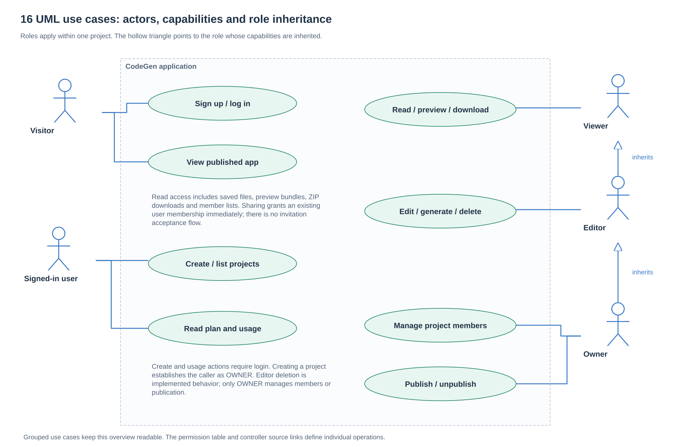
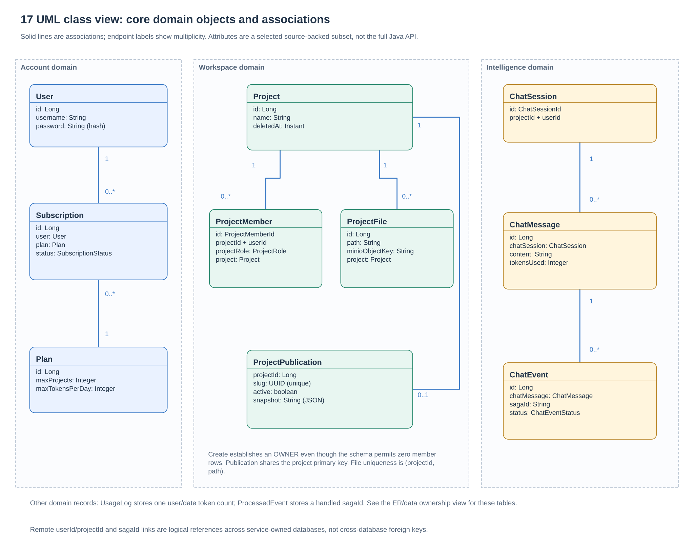
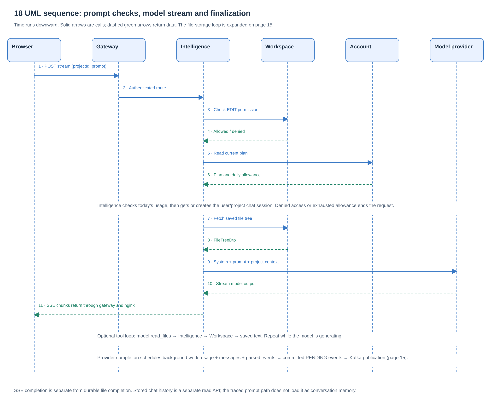
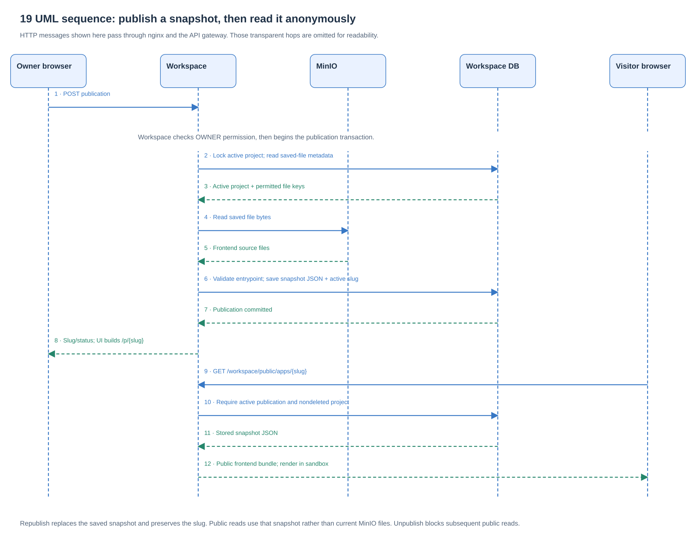
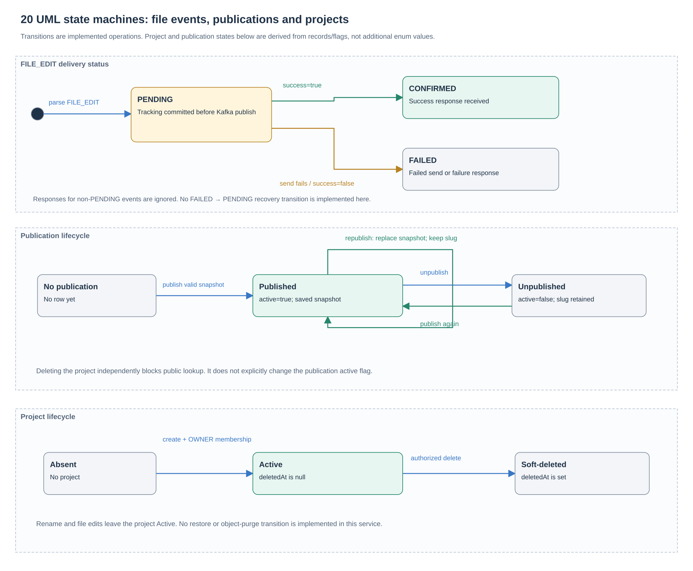
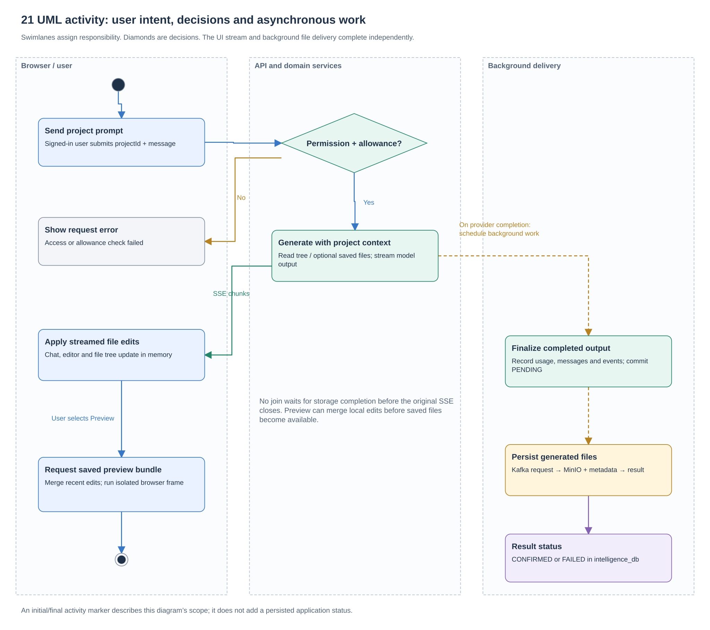
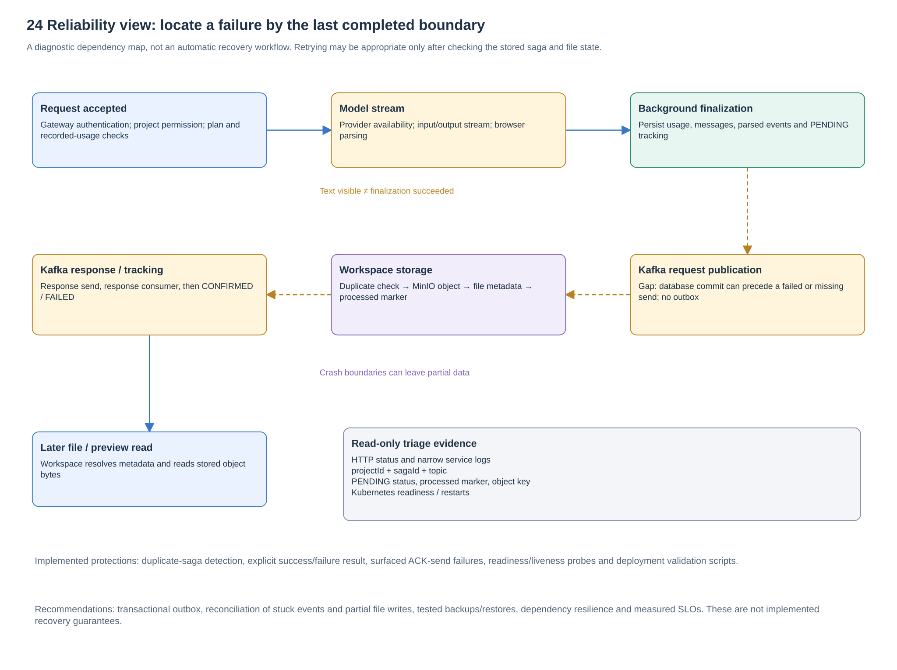
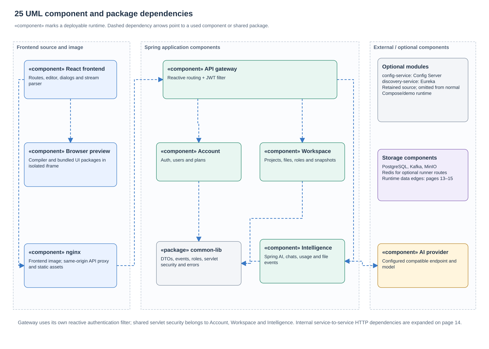

# UML and engineering views

These views complement the component dataflow and ER diagram. They describe source [`a5f2276`](https://github.com/Richa-2319/CodeGen-Ai-powered-project-builder/tree/a5f22762396594eb68ff7693cdecda1ea9e9c243). Use the [HLD](HIGH-LEVEL-DESIGN.md) for requirements and tradeoffs, and the [diagram index](README.md) to navigate every page.

## 16. UML use cases and actors

A visitor can authenticate or view an active published app. A signed-in user can create/list projects and inspect plan/usage. Project roles add capabilities: Viewer can read, preview and download; Editor also edits, generates and deletes; Owner also manages members and publication. Hollow triangles mean capability inheritance. Ellipses group closely related use cases for readability.

Sharing grants an existing account membership immediately. The code does not implement invitation delivery or acceptance. Owner changes are restricted; this is not a general ownership-transfer workflow. See [ProjectRole](../../common-lib/src/main/java/com/project/distributed_codegen/common_lib/enums/ProjectRole.java) and [ProjectMemberServiceImpl](../../workspace-service/src/main/java/com/project/distributed_codegen/workspace_service/service/impl/ProjectMemberServiceImpl.java).

## 17. UML domain classes

Class boxes show selected attributes and associations, not every generated getter or repository method. `1`, `0..1` and `0..*` mean exactly one, zero or one, and zero or many. `Subscription` has one User and one Plan; a User or Plan may have multiple subscription records. Workspace owns project membership, files and publication. Intelligence owns sessions, messages and events.

Project creation establishes an OWNER membership even though the database schema permits zero rows. Publication shares the project's primary key. Remote user/project IDs and saga IDs are logical references across service databases. For the complete storage picture, use the [ER and data ownership view](data-and-deployment.md#10-data-ownership).

Sources: [Subscription](../../account-service/src/main/java/com/project/distributed_codegen/account_service/entity/Subscription.java), [Plan](../../account-service/src/main/java/com/project/distributed_codegen/account_service/entity/Plan.java), [ProjectMember](../../workspace-service/src/main/java/com/project/distributed_codegen/workspace_service/entity/ProjectMember.java), [ProjectFile](../../workspace-service/src/main/java/com/project/distributed_codegen/workspace_service/entity/ProjectFile.java), [ProjectPublication](../../workspace-service/src/main/java/com/project/distributed_codegen/workspace_service/entity/ProjectPublication.java), [ChatMessage](../../intelligence-service/src/main/java/com/project/distributed_codegen/intelligence_service/entity/ChatMessage.java), [ChatEvent](../../intelligence-service/src/main/java/com/project/distributed_codegen/intelligence_service/entity/ChatEvent.java).

## 18. UML AI generation sequence

Time runs downward. Solid blue arrows are calls and dashed green arrows return data. Permission and usage checks precede generation. The file tree and optional `read_files` tool provide saved project context. Text returns over SSE; background finalization starts after provider completion. The [Kafka dataflow](microservice-dataflow.md#15-kafka-file-storage-and-result-dataflow) expands the asynchronous storage phase.

This diagram compresses repeated chunks and optional tool calls; it does not imply that they happen only once. Persisted chat history is a separate read API, not automatically loaded model conversation memory. Source: [AiGenerationServiceImpl](../../intelligence-service/src/main/java/com/project/distributed_codegen/intelligence_service/service/impl/AiGenerationServiceImpl.java).

## 19. UML publish and anonymous-read sequence

Publication checks owner permission, locks the active project, reads allowed saved files, validates an entrypoint and stores snapshot JSON. Public retrieval later checks the active flag and nondeleted project, then returns that snapshot. Gateway/nginx forwarding is omitted from this sequence to keep the business exchanges clear.

Republish preserves the slug and replaces the snapshot. Publication does not create a container, pod, deployment or separate cloud application. Source: [PublicationService](../../workspace-service/src/main/java/com/project/distributed_codegen/workspace_service/service/PublicationService.java), [PreviewSnapshotService](../../workspace-service/src/main/java/com/project/distributed_codegen/workspace_service/service/PreviewSnapshotService.java).

## 20. UML state machines

The file-edit enum transitions from PENDING to CONFIRMED or FAILED. A failed send also sets FAILED. Responses for non-PENDING events are ignored; this code does not automatically restart FAILED events.

Publication states are derived from row presence and `active`. Project states are derived from record presence and `deletedAt`. Deleting a project blocks public lookup independently of the publication's active flag. No project restore or object purge is represented because this service does not implement those transitions. `PreviewStatus` in the separate server-runner model must not be mistaken for a persisted browser-preview lifecycle.

Sources: [response handler](../../intelligence-service/src/main/java/com/project/distributed_codegen/intelligence_service/consumer/IntelligenceSagaResponseHandler.java), [request publisher](../../intelligence-service/src/main/java/com/project/distributed_codegen/intelligence_service/service/FileStorageRequestPublisher.java), [ProjectServiceImpl](../../workspace-service/src/main/java/com/project/distributed_codegen/workspace_service/service/impl/ProjectServiceImpl.java), [PublicationService](../../workspace-service/src/main/java/com/project/distributed_codegen/workspace_service/service/PublicationService.java).

## 21. UML activity and responsibility lanes

Swimlanes separate the user/browser, interactive services and background delivery. The diamond branches on permission and allowance. UI updates and storage completion have separate lifecycles: the original stream does not wait for a storage ACK. Initial/final activity markers describe this diagram's scope and do not introduce new persisted statuses.

## 23. Trust boundaries and security

The main application holds login state; the sandbox receives only source data and a run identifier. The gateway filters external routes, while domain services enforce identity and project authorization. Public snapshots intentionally cross an anonymous-read boundary. Model calls transmit prompt and selected source context to the configured provider.

The diagram separates application checks from deployment controls. NetworkPolicies require an enforcing network implementation; the demo Flannel choice does not enforce them. Read the [HLD security section](HIGH-LEVEL-DESIGN.md#7-security-and-trust-boundaries) for implemented controls and hardening gaps.

## 24. Failure and recovery boundaries

Start from the last confirmed boundary: request acceptance, model output, persisted tracking, Kafka send, object/metadata save, storage response, or later file read. Correlate project and saga IDs without logging private source or credentials. A successful readiness probe does not prove the complete AI-to-storage path.

This is a diagnostic view, not an automatic repair mechanism. Outbox/reconciliation, tested restore procedures, resilient dependencies and measured SLOs are recommendations. [HLD availability and recovery](HIGH-LEVEL-DESIGN.md#8-availability-recovery-and-observability).

## 25. UML component and package dependencies

Dashed dependency arrows point toward the used component/package. `common-lib` is linked code, not a running service. Gateway owns reactive JWT filtering; business services use the shared servlet security configuration. Config Server and Eureka remain optional modules. Direct business-service API dependencies appear separately in [page 14](microservice-dataflow.md#14-direct-microservice-http-exchanges).

The React application, sandbox assets and nginx configuration belong to the frontend source/image; browser-executed code and the nginx process have different runtime locations. Sources: [root Maven modules](../../pom.xml), [frontend build](../../frontend/package.json), [active Kubernetes services](../../k8s/services/kustomization.yaml).

Deployment views are in [Kubernetes components](kubernetes-components.md); the delivery pipeline is [page 11](data-and-deployment.md#11-build-release-and-deploy). Return to the [complete diagram index](README.md).
