# CodeGen UI screenshot gallery

Thirteen screenshots show the main interfaces, from account creation to editing,
previewing, sharing and publishing a project. Follow the numbered tour below;
click an image to view it at full size.

**Capture context:** 13 September 2026, Chrome, 1512 × 805 pixels. These are
unaltered browser captures of the actual React frontend built from
[`662c872`](https://github.com/Richa-2319/CodeGen-Ai-powered-project-builder/tree/662c872b4438b541608e29ed1e8e8a9842a880ab/frontend).
The application source was unchanged. A temporary loopback server supplied
fictional users, projects, chat history, source files, memberships, publication
state and usage totals. The sample Taskboard is a handcrafted fixture rendered
by CodeGen's real browser preview runtime.

These images document the UI with demo data. They do not verify live AI
generation, backend authentication, database persistence, access enforcement,
cloud billing or public deployment reachability. The loopback links pictured
in the dialogs are local examples, not hosted demo endpoints. No real account
details, credentials or private deployment addresses are included.

[Project README](../../README.md) · [Architecture and diagrams](../architecture/README.md) ·
[High Level Design](../architecture/HIGH-LEVEL-DESIGN.md) ·
[Feature guide](../../deployment/FEATURES.md)

## Tour at a glance

| Step | Interface | What to look for |
| --- | --- | --- |
| 01 | [Sign in](#01-sign-in) | Email/password form and signup navigation |
| 02 | [Create an account](#02-create-an-account) | Name, email and password inputs |
| 03 | [Project dashboard](#03-project-dashboard) | Project cards, ownership and search |
| 04 | [Create a project](#04-create-a-project) | Named project creation dialog |
| 05 | [Search empty state](#05-search-empty-state) | Feedback when no projects match |
| 06 | [Workspace and preview](#06-workspace-and-preview) | Chat history beside the running sample app |
| 07 | [Code editor](#07-code-editor) | File tree, source tab, syntax highlighting and Save |
| 08 | [Share and permissions](#08-share-and-permissions) | Private link, membership and role controls |
| 09 | [Publish a snapshot](#09-publish-a-snapshot) | Scope of publication and browser-only limitations |
| 10 | [Published app controls](#10-published-app-controls) | Public link, republish and unpublish controls |
| 11 | [Plan and usage](#11-plan-and-usage) | Project allowance and example daily token totals |
| 12 | [Standalone app](#12-standalone-app) | Published-app route without the editor shell |
| 13 | [Invalid app link](#13-invalid-app-link) | Validation feedback for a malformed publication link |

## 01. Sign in

The sign-in page accepts an email and password and links to account creation.
The screenshot shows the blank form; the password dots are placeholder text.
In the deployed flow, the frontend calls Account through the gateway.

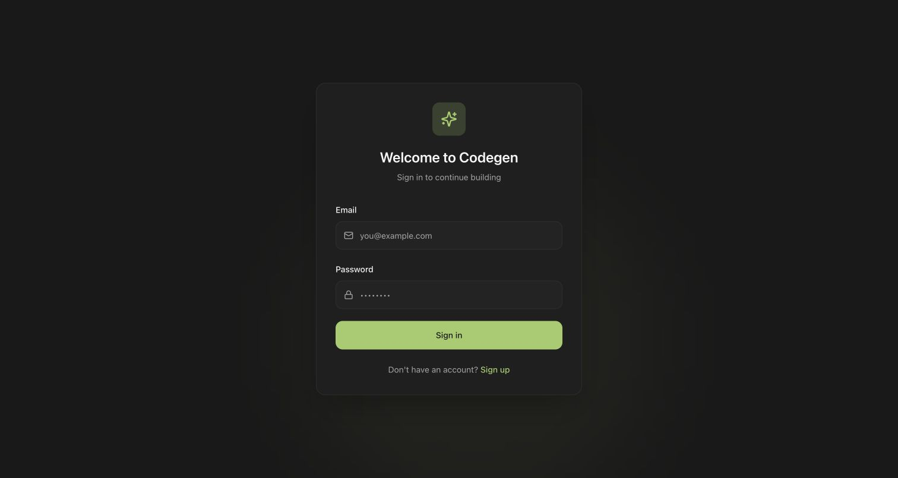

Related: [Authentication flow](../architecture/authentication-and-projects.md#3-signup-login-and-request-security).

## 02. Create an account

Signup collects a full name, email and password. This capture shows the form
without submitting it or creating a real account.

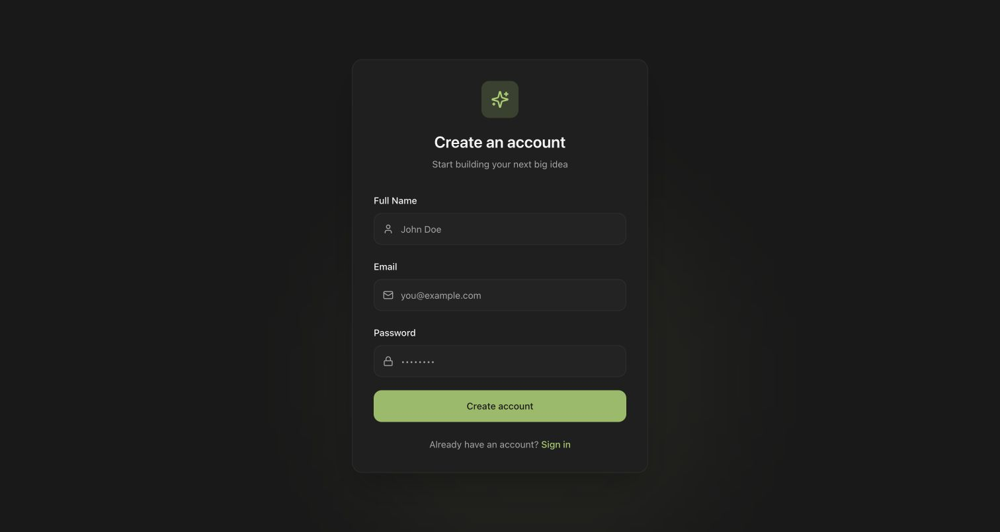

Related: [Account and project lifecycle](../architecture/authentication-and-projects.md).

## 03. Project dashboard

The dashboard lists three fictional projects, including two owned projects and
one with editor access. Cards show the project name, role and date; the header
provides search and project creation.

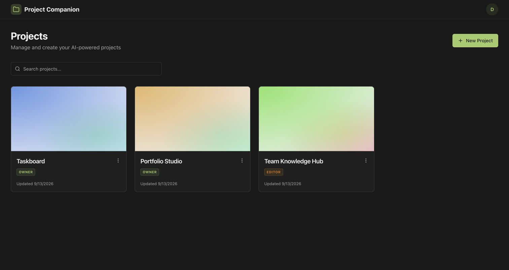

Related: [Project lifecycle](../architecture/authentication-and-projects.md#4-project-lifecycle).

## 04. Create a project

The creation dialog contains a sample project name and the Cancel and Create
Project actions. This screen was captured before submission.

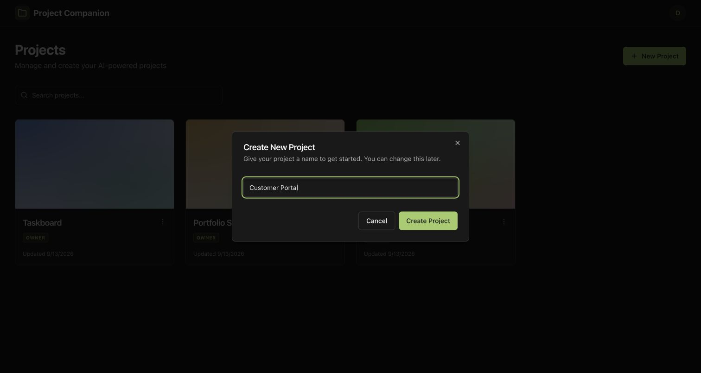

Related: [Project lifecycle](../architecture/authentication-and-projects.md#4-project-lifecycle).

## 05. Search empty state

A query with no matches replaces the project cards with guidance to try a
different search. This is a filtered result, not a failed backend request.

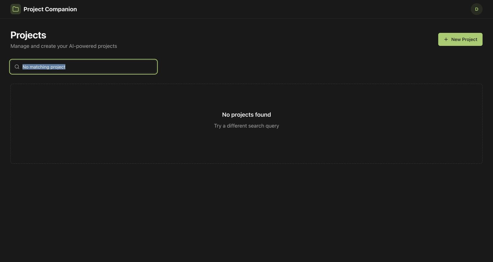

## 06. Workspace and preview

The left panel displays fixture chat history and edited-file references. The
right panel runs the sample Taskboard through the actual sandboxed browser
preview: completion cards, checklist and an add-task form. This illustrates
how generated files appear in the workspace; the pictured conversation was
supplied by the fixture and was not produced by a live model invocation.

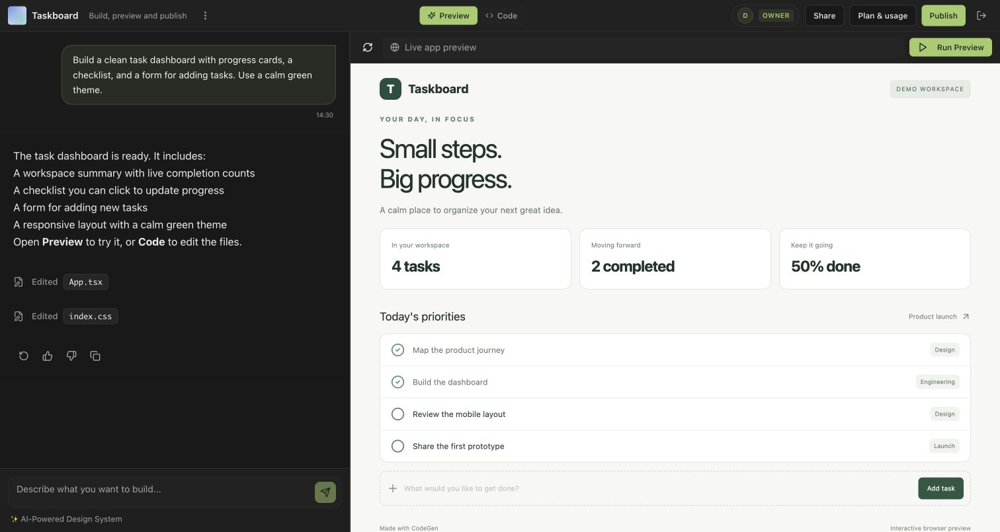

Related: [AI and file delivery](../architecture/ai-and-file-delivery.md) ·
[Editor and preview](../architecture/preview-and-publishing.md#7-edit-save-and-preview).

## 07. Code editor

Switching to Code reveals the file tree and the selected React source file.
The editor shows a saved state and a disabled Save button because no edit is
pending. The files are synthetic sample project content.

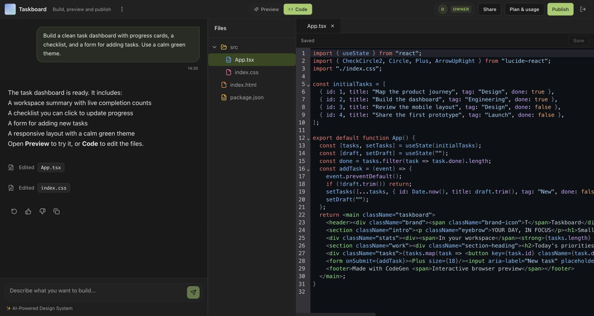

Related: [Edit, save and preview flow](../architecture/preview-and-publishing.md#7-edit-save-and-preview).

## 08. Share and permissions

The owner sees a private project link, an existing-account invitation field,
and fictional members with Owner, Can edit and Can view roles. Private sharing
is distinct from public app publication. No real invitations were sent.

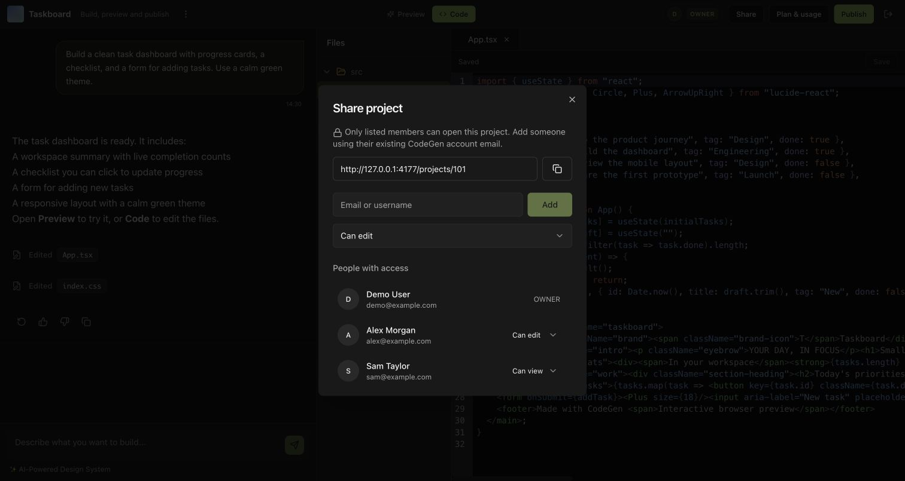

Related: [Sharing and permissions](../architecture/authentication-and-projects.md#8-sharing-and-permissions).

## 09. Publish a snapshot

The publish dialog explains that a saved frontend snapshot and its frontend
source become accessible through a public link. It also explains that preview
testing comes first and that external APIs and server processes are unavailable
in the browser sandbox.

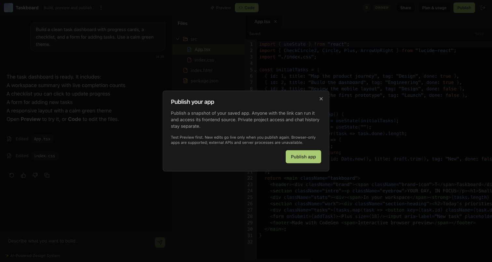

Related: [Publication flow](../architecture/preview-and-publishing.md#9-publish-republish-and-unpublish).

## 10. Published app controls

After a simulated local publish response, the dialog displays the app link,
Copy link, Open app, Unpublish and Publish latest version. The pictured URL
belongs to the temporary local fixture. No public cloud deployment was created
by this screenshot session.

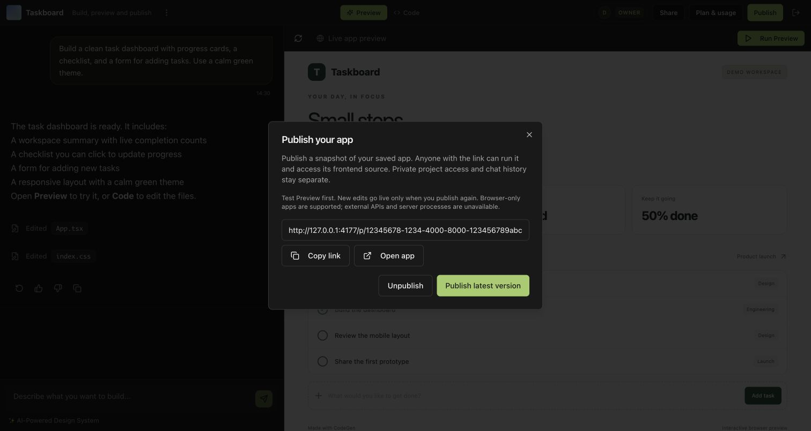

Related: [Publication sequence](../architecture/uml-and-engineering-views.md#19-uml-publish-and-anonymous-read-sequence).

## 11. Plan and usage

The panel shows example plan and usage values: two owned projects out of five,
a daily allowance of 50,000 tokens and 12,480 tokens used. These are fictional
display values, not measured usage or pricing. Paid upgrades remain disabled;
the panel explains that cloud provider billing is separate.

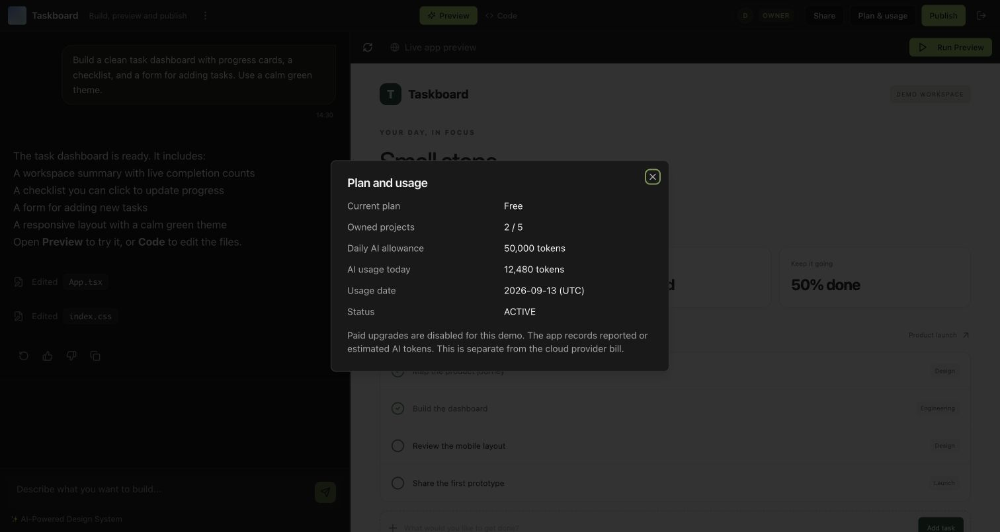

Related: [Plans, quotas and usage](../architecture/ai-and-file-delivery.md#12-plans-quotas-and-usage).

## 12. Standalone app

The published-app route renders the same sample frontend without CodeGen's
private chat, source editor or collaboration controls. This capture exercises
the real public-page component and browser runtime using a local bundle fixture.

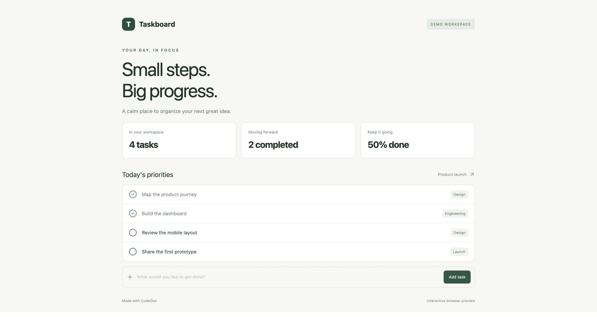

Related: [Preview and publishing](../architecture/preview-and-publishing.md).

## 13. Invalid app link

A malformed publication identifier produces “Invalid app link.” This is the
frontend's actual validation state, captured intentionally as an error-state
example. It does not represent an outage of the deployed service.

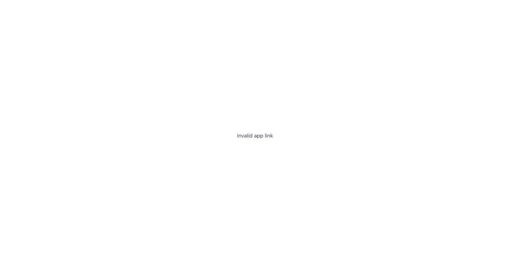

## Capture checks and maintenance

- Built the checked-in frontend with Vite and rendered its bundled browser preview.
- Opened each screen through normal browser navigation and UI controls.
- Visually reviewed all 13 images for legibility and private information.
- Checked image integrity, dimensions, file hashes and documentation links.
- Backend and cloud integration tests were not run for this documentation change.

[capture-manifest.json](capture-manifest.json) records each image's dimensions,
SHA-256 and capture context. When the UI changes, recapture with fictional data
and update the image, caption and manifest together. Keep the matching
Obsidian gallery and attachments in sync.
